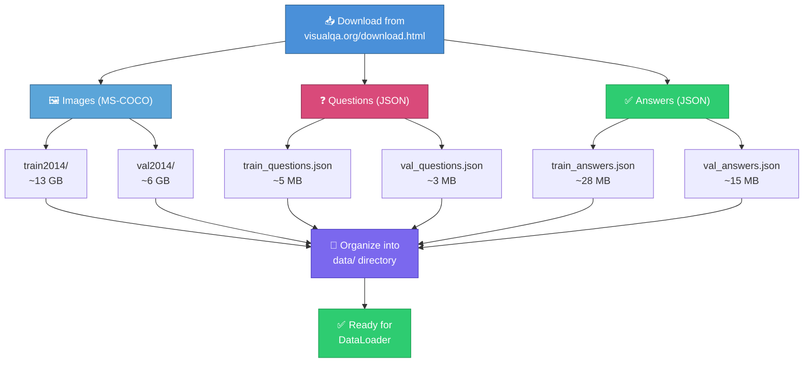
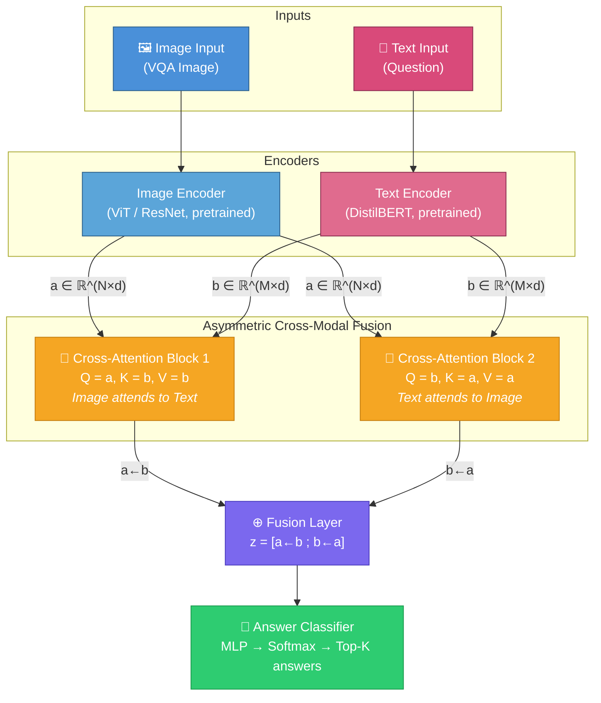
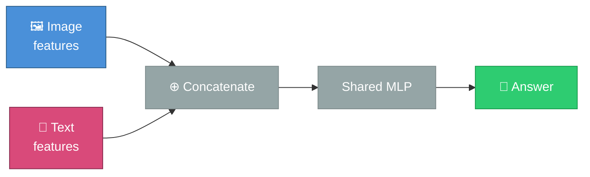
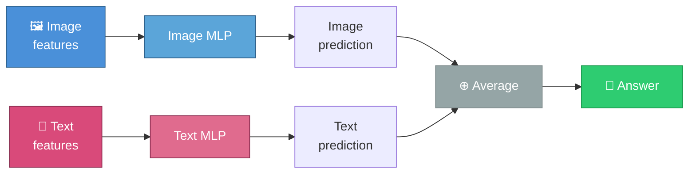
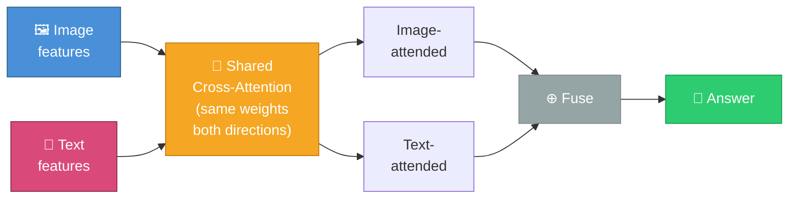
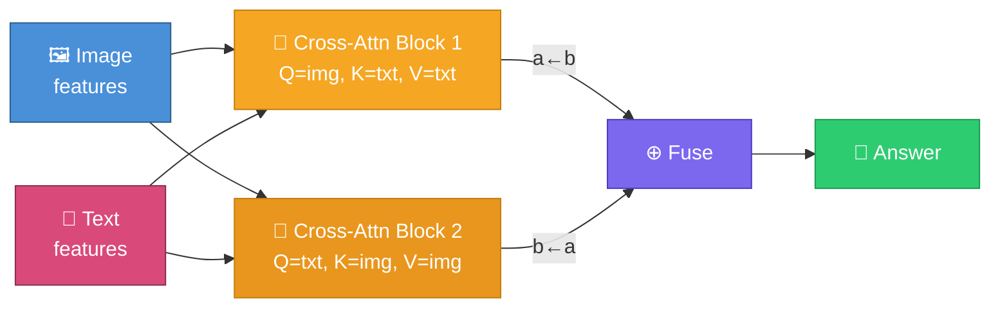
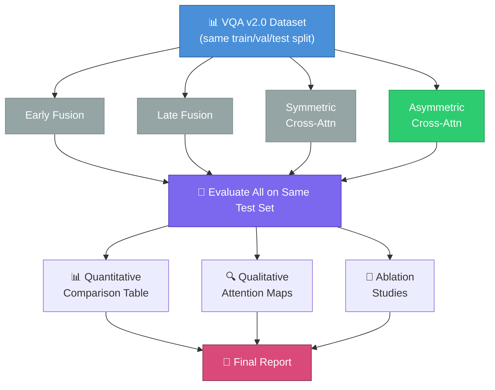
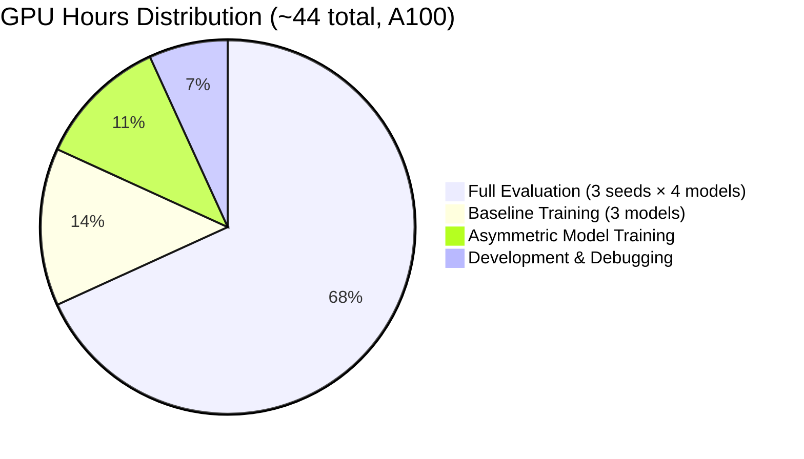
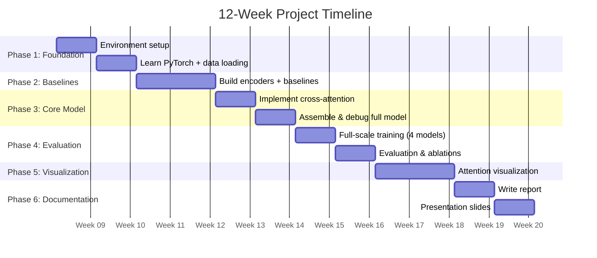

# Detailed Project Proposal: Implementing Asymmetric Cross-Modal Attention

## A Step-by-Step Implementation Guide for High School Students

---

## Table of Contents

1. [Project Overview](#1-project-overview)
2. [Objectives](#2-objectives)
3. [Data Sourcing Strategy](#3-data-sourcing-strategy)
4. [Model Development Approach](#4-model-development-approach)
5. [Testing Methodology & Validation Plan](#5-testing-methodology--validation-plan)
6. [Comparison with Traditional Methods](#6-comparison-with-traditional-methods)
7. [Multi-Phase Implementation Plan](#7-multi-phase-implementation-plan)
8. [Required Tools, Libraries & Resources](#8-required-tools-libraries--resources)
9. [Timeline Estimates](#9-timeline-estimates)
10. [Risk Assessment & Mitigation](#10-risk-assessment--mitigation)
11. [Expected Deliverables](#11-expected-deliverables)

### Project Workflow Overview


---

## 1. Project Overview

### What We're Building

We will implement the **Asymmetric Cross-Modal Attention** framework described in the paper and evaluate it on a real multimodal dataset. The project will demonstrate that modeling directional (asymmetric) interactions between data modalities produces better results than traditional symmetric or simple fusion approaches.

### Scope

Given the constraints of a high school project (Google Colab Pro compute budget, limited time, and prior experience with research-level ML), we will:

- Focus on **one primary multimodal task**: Visual Question Answering (VQA) -- given an image and a question about it, predict the answer.
- Use **two modalities**: images and text.
- Implement the asymmetric cross-attention mechanism from scratch in PyTorch.
- Compare against three baselines: early fusion, late fusion, and symmetric cross-attention.
- Use a smaller-scale dataset and pre-trained encoders to keep compute requirements manageable.

### Why VQA?

Visual Question Answering is an ideal testbed because:
- It naturally involves two modalities (image + text question).
- The interaction is inherently asymmetric: the question tells the model *where* to look in the image, while the image provides the *evidence* to answer the question. These are fundamentally different roles.
- Well-established datasets and evaluation metrics exist.
- Results are intuitive and easy to demonstrate (you can show an image, a question, and the model's answer).

---

## 2. Objectives

### Primary Objectives

| # | Objective | Success Criteria |
|---|-----------|-----------------|
| 1 | Implement the asymmetric cross-modal attention framework | Working PyTorch code that trains without errors |
| 2 | Train and evaluate on a VQA dataset | Achieve reasonable accuracy (target: within 5-10% of published baselines) |
| 3 | Implement and compare against 3 baseline methods | Quantitative comparison table with accuracy metrics across all 4 methods |
| 4 | Demonstrate that asymmetric attention outperforms symmetric and simple fusion approaches | Statistically meaningful improvement on at least one metric |
| 5 | Visualize attention patterns to show asymmetry | Attention heatmaps showing different patterns for each direction |

### Stretch Objectives (If Time Permits)

| # | Objective | Description |
|---|-----------|-------------|
| 6 | Partial encoder fine-tuning | Unfreeze last 1-2 layers of ViT/DistilBERT; compare against fully frozen results |
| 7 | Modality ablation experiments | Test robustness when one modality is degraded |
| 8 | Build a simple web demo | Interactive interface where users upload an image and ask questions |

---

## 3. Data Sourcing Strategy

### Primary Dataset: VQA v2.0

- **Source**: [https://visualqa.org/](https://visualqa.org/)
- **Size**: ~265,000 images, ~1.1 million questions, ~11 million answers
- **Format**: Images (JPEG from MS-COCO) + Questions (JSON) + Answers (JSON)
- **License**: Creative Commons (free for research)
- **Download size**: ~25 GB for full dataset

#### Working with Colab Pro

Since the full VQA dataset is very large (~1.1M questions), we will use a **subset strategy** scaled to Colab Pro's A100 40GB GPU:

| Phase | Subset Size | Purpose |
|-------|-------------|---------|
| Development & Debugging | 1,000 image-question pairs | Fast iteration, catch bugs |
| Initial Training | 20,000-50,000 pairs | Validate that models learn |
| Full Training | 150,000-200,000 pairs | Final evaluation and comparison |

### How to Obtain the Data



**Final directory structure:**

```
data/
├── images/
│   ├── train2014/        (training images)
│   └── val2014/          (validation images)
├── questions/
│   ├── train_questions.json
│   └── val_questions.json
└── answers/
    ├── train_answers.json
    └── val_answers.json
```

### Alternative (Lighter) Dataset: DAQUAR

If VQA v2.0 is too large for your setup:
- **DAQUAR** (DAtaset for QUestion Answering on Real-world images)
- Much smaller (~12,000 question-answer pairs, ~1,500 images)
- Source: [https://www.mpi-inf.mpg.de/departments/computer-vision-and-machine-learning/research/vision-and-language/visual-turing-challenge](https://www.mpi-inf.mpg.de/departments/computer-vision-and-machine-learning/research/vision-and-language/visual-turing-challenge)

### Alternative Dataset: Hateful Memes (for a different task)

If you want to explore a classification task instead:
- **Facebook Hateful Memes** dataset
- Task: Classify whether a meme (image + text) is hateful or not
- Strongly asymmetric: text meaning changes based on image context and vice versa
- ~10,000 samples (very manageable)
- Source: [https://ai.meta.com/tools/hatefulmemes/](https://ai.meta.com/tools/hatefulmemes/)

---

## 4. Model Development Approach

### Architecture Overview



### Step-by-Step Implementation

#### Step 1: Set Up the Environment

```python
# requirements.txt
torch>=2.0.0
torchvision>=0.15.0
transformers>=4.30.0       # For pre-trained BERT
Pillow>=9.0.0              # Image loading
matplotlib>=3.7.0          # Visualization
seaborn>=0.12.0            # Attention heatmaps
tqdm>=4.65.0               # Progress bars
numpy>=1.24.0
pandas>=2.0.0
scikit-learn>=1.2.0        # Metrics
tensorboard>=2.13.0        # Training monitoring
```

#### Step 2: Data Loading & Preprocessing

Build a PyTorch `Dataset` class that:
1. Loads an image and resizes it to 224x224 pixels
2. Loads the corresponding question as a string
3. Loads the answer and converts it to a class index (top-K most common answers)
4. Returns `(image_tensor, question_tokens, answer_index)`

```python
# Pseudocode for the data pipeline
class VQADataset(Dataset):
    def __init__(self, image_dir, questions_file, answers_file, top_k_answers=1000):
        # Load questions and answers from JSON
        # Filter to only keep the top_k most frequent answers
        # Set up image transforms (resize, normalize)
        # Tokenize questions using BERT tokenizer

    def __getitem__(self, idx):
        # Load and transform image
        # Get tokenized question
        # Get answer index
        return image, question_tokens, answer_idx
```

**Why top-K answers?** VQA has thousands of unique answers. We treat it as a classification problem over the K most common answers (e.g., K=1000 covers ~85% of all answers).

#### Step 3: Build the Encoders

**Image Encoder** -- Use a pre-trained Vision Transformer (ViT) or ResNet:

```python
# Using a pre-trained ViT (recommended)
# Option 1 (default): freeze all encoder params — see "Encoder Freezing Strategy" below
class ImageEncoder(nn.Module):
    def __init__(self, embed_dim=512, freeze=True):
        # Load pre-trained ViT from torchvision or HuggingFace
        # Remove the classification head
        # Add a linear projection to embed_dim if needed
        # If freeze=True: set requires_grad=False for all params (Option 1)

    def forward(self, images):
        # Returns: patch embeddings of shape (batch, num_patches, embed_dim)
        # e.g., (32, 197, 512) for ViT-Base with 16x16 patches
```

**Text Encoder** -- Use a pre-trained BERT (or DistilBERT for speed):

```python
# Option 1 (default): freeze all encoder params — see "Encoder Freezing Strategy" below
class TextEncoder(nn.Module):
    def __init__(self, embed_dim=512, freeze=True):
        # Load pre-trained DistilBERT from HuggingFace
        # Add a linear projection to embed_dim
        # If freeze=True: set requires_grad=False for all params (Option 1)

    def forward(self, input_ids, attention_mask):
        # Returns: token embeddings of shape (batch, seq_len, embed_dim)
        # e.g., (32, 20, 512) for questions up to 20 tokens
```

**Why pre-trained encoders?** Training encoders from scratch requires massive datasets and compute. Pre-trained models already understand images and text; we just need to teach them to work together.

#### Pre-trained Encoder Options

The tables below cover the full spectrum of encoder choices from established classics to modern frontier models. Each table is sorted from classic to modern so you can pick the right tier for your needs. Since this project runs on **Google Colab Pro** (A100 40GB GPU, ~100 compute units/month), we recommend **Classic tier** encoders for simplicity and reliable performance within the compute budget. Modern and Frontier tiers are listed for reference — Modern encoders are feasible frozen on Colab Pro but add complexity, while Frontier encoders exceed what Colab Pro can handle.

##### Image Encoders

| Tier | Encoder Model | Type/Size | Pros | Cons |
| :--- | :--- | :--- | :--- | :--- |
| Classic | **ResNet-50** | CNN (25M params) | Battle-tested; extremely well-documented; trivial to load via `torchvision.models`; produces a flat 2048-d global feature vector. | No spatial patch tokens, so cross-attention has limited spatial granularity; weaker features than modern ViTs. |
| Classic | **ViT-B/16** | Vision Transformer (86M params) | Canonical ViT baseline; produces 196 patch embeddings ideal for cross-attention; widely supported in both `torchvision` and HuggingFace. | Outclassed by self-supervised or larger variants; patch representations are relatively noisy without stronger pre-training. |
| Classic | **EfficientNet-V2-S** | CNN (22M params) | Strong accuracy-to-parameter ratio; faster inference than ResNet-50; good for a lightweight CNN baseline. | Still produces a single global feature vector; lacks the patch-level spatial tokens that attention mechanisms benefit from. |
| Modern | **DINOv2** *(ViT-L/14)* | Self-supervised Vision Transformer (307M params) | Exceptional dense and semantic patch features with no fine-tuning required; a go-to frozen backbone for downstream tasks. | Pure vision model; not explicitly pre-aligned with text out of the box. |
| Modern | **SigLIP** *(So400M)* | Vision-Language contrastive model (400M params) | Best-in-class contrastive multimodal model; visual features are already aligned with text semantics, giving the cross-attention a head start. | Requires HuggingFace `transformers`; slightly higher VRAM than a standalone ViT. |
| Frontier | **DINOv2** *(ViT-g/14)* | Self-supervised Vision Transformer (1.1B params) | Best available frozen visual representations; extreme spatial detail; top performance on dense prediction benchmarks. | 1.1B parameters; requires significant VRAM for feature extraction even without fine-tuning. |
| Frontier | **InternVL-2** *(ViT-6B)* | Massive Vision Transformer (6B params) | Pushes the absolute limit of visual feature quality; state-of-the-art on spatial and visual reasoning benchmarks. | Extremely heavy; requires multi-GPU or high-VRAM single GPU solely for the forward pass. |

##### Text Encoders

| Tier | Encoder Model | Type/Size | Pros | Cons |
| :--- | :--- | :--- | :--- | :--- |
| Classic | **DistilBERT** *(Base)* | Bidirectional Encoder (66M params) | 40% smaller and 60% faster than BERT-base with ~97% of its performance; the standard lightweight text encoder. | Less contextual depth than full BERT; may miss subtle semantic nuances in complex questions. |
| Classic | **BERT** *(Base-Uncased)* | Bidirectional Encoder (110M params) | The canonical NLP baseline; ubiquitous support across frameworks; produces per-token `[CLS]`-poolable embeddings. | Superseded by newer encoders; limited context window (512 tokens); dated pre-training corpus. |
| Classic | **RoBERTa** *(Base)* | Bidirectional Encoder (125M params) | Significantly stronger than BERT-base due to improved pre-training procedure; better context representation on downstream tasks. | Similar parameter count to BERT but requires HuggingFace; static 512-token window. |
| Modern | **DeBERTa-V3** *(Large)* | Bidirectional Encoder (304M params) | Disentangled attention mechanism yields markedly stronger performance on reading comprehension and contextual reasoning tasks than RoBERTa. | Slightly more complex tokenizer setup compared to standard BERT-family models. |
| Modern | **ModernBERT** *(Large)* | Bidirectional Encoder (395M params) | Recent (2024) architectural redesign of BERT; native 8192-token context, FlashAttention-2, and strong benchmark results across NLP tasks. | Requires up-to-date `transformers`; may need explicit flash-attention install for full speedup. |
| Frontier | **Llama-3.2** *(8B or 70B)* | Auto-regressive LLM (8B–70B params) | Vast generalized world knowledge and robust chain-of-thought reasoning; strong for open-ended semantic understanding. | Decoder-only; requires explicit pooling of hidden states (last-token or mean-pool) in place of a `[CLS]` token; large memory footprint. |
| Frontier | **Qwen2.5** *(14B or 72B)* | Advanced LLM (14B–72B params) | State-of-the-art open-weight language model; unparalleled text comprehension, multilingual capability, and reasoning depth. | Immense VRAM footprint; multi-GPU recommended even for feature extraction alone. |

#### Recommendation

The asymmetric cross-attention mechanism operates on **sequences**: it cross-attends between a set of image patch tokens and a set of text word tokens. This architectural requirement is the most important factor when choosing encoders — the image encoder *must* produce spatial patch embeddings (not a single global vector) for the cross-attention to have meaningful spatial structure to attend over. Similarly, the text encoder must output per-token embeddings so the model can learn which words guide attention to which image regions.

With this in mind, and considering the project's Colab Pro compute budget (A100 40GB, frozen encoders, batch size 64), we recommend:

| Modality | Recommended Encoder | Why This One |
| :--- | :--- | :--- |
| **Image** | **ViT-B/16** | Produces 196 spatial patch tokens — exactly the format cross-attention needs. Canonical baseline used across VQA literature, making results directly comparable to published work. At 86M params frozen, it uses minimal VRAM and leaves ample room for the fusion layers and large batch sizes. Loadable in one line via `torchvision` or HuggingFace. |
| **Text** | **RoBERTa** *(Base)* | A strict upgrade over BERT-base — same 125M parameter count and identical API, but trained with an improved procedure that yields measurably better contextual representations. Produces per-token embeddings with a standard `[CLS]` token. VQA questions are short (< 20 tokens), so the 512-token context window is more than sufficient. |

**Why not the others?**

| Encoder | Reason for not recommending as primary |
| :--- | :--- |
| **ResNet-50 / EfficientNet-V2-S** | Produce a single global feature vector (2048-d / 1280-d), giving cross-attention only one "token" per image. This fundamentally undermines the spatial attention mechanism that is central to the project. Unsuitable for the asymmetric cross-attention architecture. |
| **DistilBERT** | Viable but unnecessary — RoBERTa-base is the same complexity to set up yet produces noticeably stronger representations. No reason to leave accuracy on the table. |
| **BERT (Base-Uncased)** | Strictly inferior to RoBERTa-base at the same parameter count. Only worth using if reproducing a specific published baseline that used BERT. |
| **DINOv2 / SigLIP (Modern)** | Produce superior frozen features and would improve results. However, they add setup complexity (HuggingFace-only, larger downloads) without contributing to the core research question. Consider as a **stretch upgrade** after the primary comparison is complete. |
| **DeBERTa-V3 / ModernBERT (Modern)** | Stronger text representations, but VQA questions are short and simple — the marginal gain over RoBERTa is small relative to the added tokenizer/library complexity. Also a good **stretch upgrade**. |
| **Llama / Qwen (Frontier)** | Decoder-only architectures require non-trivial pooling strategies to extract sequence embeddings — a significant implementation burden that distracts from the project's core focus on asymmetric attention. They also consume substantial VRAM even frozen, leaving less room for training. Not recommended for this project. |

**Stretch upgrade path** (once the core comparison is complete and validated):
1. Swap the image encoder to **DINOv2 (ViT-L/14)** — dramatically better frozen patch features at 307M params, still comfortable on A100 40GB. Re-run training and compare.
2. Swap the text encoder to **ModernBERT (Large)** — deeper contextual reasoning, native FlashAttention-2. Pair with DINOv2 for the strongest feasible combination on Colab Pro.

#### Encoder Freezing Strategy: Frozen vs. Fine-Tuned

A critical design decision is whether to **freeze** (fix) the encoder weights during training or **fine-tune** them. Below are two options with pros, cons, and feasibility.

---

**Option 1: Frozen Encoders (Fixed, Not Updated During Training)**

- **Setup**: Image and text encoders are **fixed** — their weights do not change. Only the **asymmetric fusion** (cross-attention blocks + classifier) is trained.
- **Architecture**: Independently encode images and text using fixed, pre-trained models. Combine encodings via asymmetric cross-modal fusion. Fusion layers are the only trainable parameters.

| Pros | Cons |
|------|------|
| ✅ **Simplest to implement** — just `requires_grad=False` on encoder params | ❌ May underperform if VQA vocabulary/visual concepts differ from pre-training |
| ✅ **Fastest training** — far fewer parameters to update, less memory | ❌ Cannot adapt encoders to VQA-specific patterns (e.g., "left", "right", counting) |
| ✅ **Lowest GPU memory** — no gradients through encoders | ❌ Upper bound on performance set by frozen representations |
| ✅ **Stable training** — no risk of catastrophic forgetting in encoders | |
| ✅ **Reproducible** — same encoders always produce same features | |
| ✅ **Ideal for Colab Pro** — well within A100 40GB budget | |

---

**Option 2: Fine-Tuned Encoders (Updated During Training)**

- **Setup**: Image and text encoders are **not fixed** — their weights are updated during training along with the fusion layers.
- **Architecture**: Same as Option 1, but encoder parameters participate in backpropagation.

| Pros | Cons |
|------|------|
| ✅ **Higher potential accuracy** — encoders can adapt to VQA domain | ❌ **More complex** — must manage learning rates, regularization, unfreezing schedules |
| ✅ **Better alignment** — representations can shift toward task-relevant features | ❌ **Slower training** — many more parameters, more epochs needed |
| ✅ **Can capture VQA-specific concepts** (spatial relations, counting, etc.) | ❌ **Higher GPU memory** — gradients through full ViT + BERT |
| | ❌ **Risk of overfitting** on small datasets |
| | ❌ **Risk of catastrophic forgetting** — encoders may lose general knowledge |
| | ❌ **Trickier hyperparameters** — encoder LR vs. fusion LR, warmup, etc. |

---

**Feasibility & Recommendation**

| Criterion | Option 1 (Frozen) | Option 2 (Fine-Tuned) |
|-----------|-------------------|------------------------|
| **Simplicity** | ⭐⭐⭐⭐⭐ Easiest | ⭐⭐ More setup, tuning |
| **Compute** | ⭐⭐⭐⭐⭐ Low (comfortable on Colab Pro) | ⭐⭐⭐ Feasible on Colab Pro with care |
| **Time to first result** | ⭐⭐⭐⭐⭐ Fast | ⭐⭐⭐ Slower |
| **Peak performance** | ⭐⭐⭐ Good | ⭐⭐⭐⭐ Better (with enough data/compute) |
| **Debugging** | ⭐⭐⭐⭐⭐ Easier (fewer moving parts) | ⭐⭐⭐ Harder |

**Recommendation: Start with Option 1 (Frozen Encoders).**

For a high school project on Colab Pro, **Option 1 is the recommended starting point**:

1. **Implement first** with frozen encoders. Get the asymmetric fusion working and validate that the pipeline trains.
2. **Baseline results** with frozen encoders are sufficient to compare against the other baselines.
3. **Stretch goal**: If you have extra time, try unfreezing the last 1–2 layers of each encoder (partial fine-tuning). Colab Pro's A100 40GB can handle this — use a lower learning rate (e.g., 1e-5) for encoder layers vs. the fusion layers (1e-4).

**Implementation (Option 1):**

```python
# Freeze encoders — only fusion + classifier are trained
for param in model.image_encoder.parameters():
    param.requires_grad = False
for param in model.text_encoder.parameters():
    param.requires_grad = False

# Fusion and classifier params remain requires_grad=True (default)
optimizer = torch.optim.AdamW(
    filter(lambda p: p.requires_grad, model.parameters()),
    lr=1e-4
)
```

---

#### Step 4: Implement the Asymmetric Cross-Attention (Core Component)

```python
class CrossAttentionBlock(nn.Module):
    def __init__(self, embed_dim, num_heads=8):
        # Multi-head attention where Q comes from one modality
        # and K, V come from the other modality
        # Include layer normalization and residual connections

    def forward(self, query, key_value):
        # query: (batch, seq_q, embed_dim) -- from modality A
        # key_value: (batch, seq_kv, embed_dim) -- from modality B
        # Returns: cross-attended representation (batch, seq_q, embed_dim)


class AsymmetricCrossModalFusion(nn.Module):
    def __init__(self, embed_dim, num_heads=8):
        self.cross_attn_a_to_b = CrossAttentionBlock(embed_dim, num_heads)
        self.cross_attn_b_to_a = CrossAttentionBlock(embed_dim, num_heads)

    def forward(self, a, b):
        a_attended = self.cross_attn_a_to_b(query=a, key_value=b)  # a←b
        b_attended = self.cross_attn_b_to_a(query=b, key_value=a)  # b←a
        return a_attended, b_attended
```

#### Step 5: Build the Full Model

```python
class AsymmetricVQAModel(nn.Module):
    def __init__(self, num_answers, embed_dim=512, num_heads=8):
        self.image_encoder = ImageEncoder(embed_dim)
        self.text_encoder = TextEncoder(embed_dim)
        self.fusion = AsymmetricCrossModalFusion(embed_dim, num_heads)
        self.classifier = nn.Sequential(
            nn.Linear(embed_dim * 2, embed_dim),
            nn.ReLU(),
            nn.Dropout(0.3),
            nn.Linear(embed_dim, num_answers)
        )

    def forward(self, images, input_ids, attention_mask):
        a = self.image_encoder(images)                    # (B, N, d)
        b = self.text_encoder(input_ids, attention_mask)  # (B, M, d)

        a_attended, b_attended = self.fusion(a, b)        # Asymmetric fusion

        # Pool: take mean across sequence dimensions
        a_pooled = a_attended.mean(dim=1)                 # (B, d)
        b_pooled = b_attended.mean(dim=1)                 # (B, d)

        z = torch.cat([a_pooled, b_pooled], dim=-1)       # (B, 2d)
        logits = self.classifier(z)                        # (B, num_answers)
        return logits
```

#### Step 6: Training Loop

```python
# Training configuration
config = {
    "batch_size": 64,       # A100 40GB handles 64 comfortably with frozen encoders
    "learning_rate": 1e-4,
    "weight_decay": 1e-5,
    "epochs": 20,
    "num_answers": 1000,
    "embed_dim": 512,
    "num_heads": 8,
}

# Training pseudocode
for epoch in range(config["epochs"]):
    model.train()
    for images, questions, answers in train_loader:
        logits = model(images, questions)
        loss = cross_entropy_loss(logits, answers)
        loss.backward()
        optimizer.step()
        optimizer.zero_grad()

    # Validate after each epoch
    model.eval()
    accuracy = evaluate(model, val_loader)
    print(f"Epoch {epoch}: Val Accuracy = {accuracy:.2f}%")
```

---

## 5. Testing Methodology & Validation Plan

### Metrics

| Metric | What It Measures | How to Compute |
|--------|-----------------|----------------|
| **Top-1 Accuracy** | % of questions where the top predicted answer is correct | `correct / total` |
| **Top-5 Accuracy** | % of questions where the correct answer is in the top 5 predictions | Useful when answers are ambiguous |
| **VQA Accuracy** | Official VQA metric: `min(# humans who gave that answer / 3, 1)` | Accounts for answer ambiguity |
| **Per-Category Accuracy** | Accuracy broken down by question type (yes/no, number, other) | Reveals strengths/weaknesses |

### Validation Strategy

```mermaid
graph TD
    VP["🧪 Validation Plan"]

    VP --> SPLIT["1. Train / Val / Test Split"]
    SPLIT --> S1["Training: 80%"]
    SPLIT --> S2["Validation: 10%<br/>(tune hyperparams)"]
    SPLIT --> S3["Test: 10%<br/>(final evaluation)"]

    VP --> KFOLD["2. K-Fold Cross-Validation<br/>(if time allows)"]
    KFOLD --> K1["5-fold CV for<br/>robust estimates"]

    VP --> ABLATION["3. Ablation Studies"]
    ABLATION --> A1["Remove image<br/>(text only)"]
    ABLATION --> A2["Remove text<br/>(image only)"]
    ABLATION --> A3["Add Gaussian<br/>noise to images"]
    ABLATION --> A4["Randomly mask<br/>question words"]

    VP --> ATTN["4. Attention Visualization"]
    ATTN --> V1["Plot weights:<br/>Block 1 (img→txt)"]
    ATTN --> V2["Plot weights:<br/>Block 2 (txt→img)"]
    ATTN --> V3["Compare: are the<br/>patterns different?"]

    VP --> STATS["5. Statistical Significance"]
    STATS --> ST1["Run each model ×3<br/>(different random seeds)"]
    STATS --> ST2["Report mean ±<br/>standard deviation"]

    style VP fill:#7B68EE,stroke:#4B3BBE,color:#fff
    style SPLIT fill:#4A90D9,stroke:#2C5F8A,color:#fff
    style KFOLD fill:#4A90D9,stroke:#2C5F8A,color:#fff
    style ABLATION fill:#F5A623,stroke:#C47D0E,color:#fff
    style ATTN fill:#2ECC71,stroke:#1A9B4E,color:#fff
    style STATS fill:#D94A7A,stroke:#8A2C4F,color:#fff
```



### Qualitative Analysis

For a subset of test examples, create visualizations showing:
1. The input image
2. The question
3. The model's predicted answer vs. ground truth
4. Attention heatmaps overlaid on the image (what parts of the image did the model focus on?)
5. Attention weights over question words (which words were most important?)

---

## 6. Comparison with Traditional Methods

We will implement and compare **four methods** total:

Below is a side-by-side view of all four methods. Each diagram highlights the fundamental architectural difference.

### Baseline 1: Early Fusion



- Concatenate image and text features at the input level
- Pass through a shared multi-layer perceptron
- **Expected weakness**: Loses modality-specific structure

### Baseline 2: Late Fusion



- Process each modality independently through separate MLPs
- Average or concatenate the final predictions
- **Expected weakness**: Misses cross-modal interactions entirely

### Baseline 3: Symmetric Cross-Attention



- Use a single shared cross-attention mechanism
- Same attention weights applied in both directions
- **Expected weakness**: Cannot capture directional differences

### Our Method: Asymmetric Cross-Attention



- Two separate cross-attention blocks with **different learned weights**
- **Expected strength**: Captures directional, asymmetric interactions in BOTH directions

### Experimental Comparison Flow



### Comparison Table (Template)

| Method | Type | Top-1 Acc | Top-5 Acc | VQA Acc | Yes/No | Number | Other | # Params |
|--------|------|-----------|-----------|---------|--------|--------|-------|----------|
| Early Fusion | Simple baseline | -- | -- | -- | -- | -- | -- | -- |
| Late Fusion | Simple baseline | -- | -- | -- | -- | -- | -- | -- |
| Symmetric Cross-Attn | Modern baseline | -- | -- | -- | -- | -- | -- | -- |
| **Asymmetric Cross-Attn (Ours)** | **Paper's method** | -- | -- | -- | -- | -- | -- | -- |

---

## 7. Multi-Phase Implementation Plan

### Phase 1: Foundation (Weeks 1-2)

**Goal**: Set up the development environment and understand the building blocks.

| Task | Description | Time Est. |
|------|-------------|-----------|
| 1.1 | Install Python, PyTorch, and all dependencies | 2 hours |
| 1.2 | Learn/review PyTorch basics (tensors, nn.Module, training loops) | 3-5 days |
| 1.3 | Study the attention mechanism (watch 3Blue1Brown, Andrej Karpathy videos) | 2-3 days |
| 1.4 | Download and explore the VQA dataset (look at examples, understand format) | 1 day |
| 1.5 | Write the data loading pipeline (Dataset class, DataLoader) | 2 days |

**Milestone**: Can load and visualize image-question-answer triplets.

**Recommended Learning Resources**:
- [3Blue1Brown: Neural Networks](https://www.youtube.com/playlist?list=PLZHQObOWTQDNU6R1_67000Dx_ZCJB-3pi) (visual intuition)
- [Andrej Karpathy: Let's build GPT](https://www.youtube.com/watch?v=kCc8FmEb1nY) (attention mechanism explained)
- [PyTorch Official Tutorials](https://pytorch.org/tutorials/) (hands-on coding)
- [The Illustrated Transformer](https://jalammar.github.io/illustrated-transformer/) (visual guide to attention)

### Phase 2: Baseline Models (Weeks 3-4)

**Goal**: Implement the three baseline models and train all three.

| Task | Description | Time Est. |
|------|-------------|-----------|
| 2.1 | Implement image encoder (load pre-trained ViT/ResNet, add projection) | 1 day |
| 2.2 | Implement text encoder (load pre-trained DistilBERT, add projection) | 1 day |
| 2.3 | Implement Early Fusion baseline | 1 day |
| 2.4 | Implement Late Fusion baseline | 1 day |
| 2.5 | Implement Symmetric Cross-Attention baseline | 2 days |
| 2.6 | Train all three baselines on the small subset (1K examples) | 1-2 days |
| 2.7 | Debug and verify that all models train correctly (loss decreases) | 1-2 days |

**Milestone**: Three baseline models trained and producing predictions.

### Phase 3: Core Implementation (Weeks 5-6)

**Goal**: Implement the asymmetric cross-modal attention framework.

| Task | Description | Time Est. |
|------|-------------|-----------||
| 3.1 | Implement `CrossAttentionBlock` module | 1-2 days |
| 3.2 | Implement `AsymmetricCrossModalFusion` module | 1 day |
| 3.3 | Assemble the full `AsymmetricVQAModel` | 1 day |
| 3.4 | Write unit tests (verify tensor shapes, attention weight shapes) | 1 day |
| 3.5 | Train on small subset, debug any issues | 2-3 days |
| 3.6 | Compare initial results against baselines | 1 day |

**Milestone**: Asymmetric model trains successfully and shows competitive results.

### Phase 4: Full Training & Evaluation (Weeks 7-8)

**Goal**: Train all models on the larger dataset and conduct thorough evaluation.

| Task | Description | Time Est. |
|------|-------------|-----------||
| 4.1 | Scale up to 150K-200K training examples | 1 day (setup) |
| 4.2 | Train all four models with consistent hyperparameters | 3-4 days (GPU time) |
| 4.3 | Evaluate on test set, compute all metrics | 1 day |
| 4.4 | Run ablation studies (remove modalities, add noise) | 2 days |
| 4.5 | Run each model 3 times for statistical significance | 2-3 days (GPU time) |
| 4.6 | Fill in the comparison table | 1 day |

**Milestone**: Complete quantitative comparison across all four methods.

### Phase 5: Visualization & Analysis (Weeks 9-10)

**Goal**: Create compelling visualizations and analyze results.

| Task | Description | Time Est. |
|------|-------------|-----------||
| 5.1 | Extract and visualize attention weights from both cross-attention blocks | 2 days |
| 5.2 | Create attention heatmaps overlaid on images | 2 days |
| 5.3 | Create bar charts comparing all four model accuracies | 1 day |
| 5.4 | Analyze failure cases and interesting examples | 1-2 days |
| 5.5 | Write qualitative analysis of attention patterns | 1-2 days |

**Milestone**: Publication-quality figures and analysis.

### Phase 6: Documentation & Presentation (Weeks 11-12)

**Goal**: Write up findings and prepare presentation.

| Task | Description | Time Est. |
|------|-------------|-----------||
| 6.1 | Write project report (introduction, methods, results, conclusion) | 3-4 days |
| 6.2 | Create presentation slides | 2 days |
| 6.3 | Build simple demo (optional: Gradio web app) | 2-3 days |
| 6.4 | Review and polish all deliverables | 1-2 days |

**Milestone**: Complete project ready for submission/presentation.

---

## 9. Required Tools, Libraries & Resources

### Software

| Tool | Purpose | Cost |
|------|---------|------|
| **Python 3.10+** | Programming language | Free |
| **PyTorch 2.0+** | Deep learning framework | Free |
| **HuggingFace Transformers** | Pre-trained BERT/ViT models | Free |
| **Torchvision** | Image preprocessing, pre-trained ResNet | Free |
| **Matplotlib / Seaborn** | Plotting and visualization | Free |
| **Jupyter Notebook** | Interactive development | Free |
| **Git / GitHub** | Version control | Free |
| **TensorBoard** | Training monitoring | Free |
| **Gradio** (optional) | Web demo interface | Free |

### Hardware

| Option | Specs | Cost | Notes |
|--------|-------|------|-------|
| **Google Colab Pro** (primary) | A100 40GB GPU, 52GB system RAM | ~$10/month | Primary platform for all training; longer sessions (up to 24 hrs), ~100 compute units/month, priority GPU access |
| **Google Colab (Free)** | T4 GPU, 12GB VRAM | Free | Fallback for light development/debugging only; limited to ~12 hrs/session |
| **Kaggle Notebooks** | P100 GPU, 16GB VRAM | Free | Backup if Colab Pro compute units run low; 30 hrs/week GPU quota |
| **Personal laptop (CPU only)** | Varies | Already owned | OK for code editing and small tests, too slow for training |

**Recommendation**: Use **Google Colab Pro** as the primary compute platform for all development, training, and evaluation. The A100 40GB GPU comfortably handles classic-tier frozen encoders (ViT-B/16 + DistilBERT) with batch sizes of 64+. Keep Kaggle as a free backup if compute units run low near the end of the month.

### Compute Budget Estimate

With Colab Pro's A100 40GB and frozen classic-tier encoders, training is significantly faster than on a T4. The A100 offers ~5x throughput over a T4 for transformer workloads, so GPU hour estimates are lower than they would be on free-tier hardware.

| Phase | GPU Hours (A100) | Compute Units (approx.) | Notes |
|-------|-----------------|------------------------|-------|
| Development & debugging | ~3 hrs | ~6 units | Small subset (1K pairs), fast iteration |
| Baseline training (3 models) | ~6 hrs | ~12 units | 3 models on 150K-200K pairs |
| Asymmetric model training | ~5 hrs | ~10 units | Single model, same dataset |
| Full evaluation (3 seeds × 4 models) | ~30 hrs | ~60 units | 12 training runs total |
| **Total** | **~44 GPU hours** | **~88 units** | **Fits within ~1 month of Colab Pro** |

> **Note**: Colab Pro provides ~100 compute units/month. A100 usage costs roughly 2 units/hour. The full project fits within a single month's budget if runs are managed carefully. Spread training across 2 months for a comfortable margin.



### Knowledge Prerequisites

| Topic | Resources | Priority |
|-------|-----------|----------|
| Python programming | AP CS course (already completed) | Done |
| PyTorch basics | [PyTorch 60-min blitz](https://pytorch.org/tutorials/beginner/deep_learning_60min_blitz.html) | High |
| Neural networks fundamentals | [3Blue1Brown series](https://www.youtube.com/playlist?list=PLZHQObOWTQDNU6R1_67000Dx_ZCJB-3pi) | High |
| Attention mechanism | [The Illustrated Transformer](https://jalammar.github.io/illustrated-transformer/) | High |
| Transfer learning | [HuggingFace course](https://huggingface.co/learn/nlp-course) | Medium |
| Git version control | [Git basics](https://git-scm.com/book/en/v2) | Medium |

---

## 10. Timeline Estimates

### 12-Week Timeline (Recommended)



### Compressed 8-Week Timeline (Ambitious)

If time is limited, phases can be compressed:
- Combine Phases 1-2 into 3 weeks (skip some learning, dive in faster)
- Phase 3 in 1.5 weeks
- Phase 4 in 1.5 weeks
- Phase 5-6 in 2 weeks

### Weekly Time Commitment

- **Recommended**: 8-12 hours per week
- **Minimum viable**: 5-6 hours per week (will need the full 12 weeks)
- **Intensive**: 15-20 hours per week (can finish in 8 weeks)

---

## 10. Risk Assessment & Mitigation

| Risk | Likelihood | Impact | Mitigation |
|------|-----------|--------|------------|
| Colab Pro compute units run low | Low-Medium | Medium | Spread training across 2 months; use Kaggle (free, 30 hrs/week) as backup; reduce dataset size or number of seeds if needed |
| Model doesn't converge (loss doesn't decrease) | Medium | High | Start with tiny dataset to verify; use proven hyperparameters from VQA literature; check for bugs with unit tests |
| Asymmetric model doesn't beat symmetric | Low-Medium | Medium | This is still a valid research finding; analyze why and document it; check attention visualizations for insights |
| Dataset download issues | Low | Medium | Use DAQUAR as fallback (much smaller); cache downloaded data |
| Running out of time | Medium | High | Prioritize core comparison (Phase 4); skip stretch goals; use the compressed 8-week timeline |
| Difficulty understanding attention code | Medium | Medium | Follow The Illustrated Transformer; use PyTorch's built-in `nn.MultiheadAttention`; ask for help early |

---

## 11. Expected Deliverables

### Required Deliverables

| # | Deliverable | Format |
|---|-------------|--------|
| 1 | **Working codebase** | Python/PyTorch code on GitHub |
| 2 | **Trained models** | Saved model checkpoints (.pt files) for all 4 methods |
| 3 | **Comparison table** | Quantitative results across all 4 methods |
| 4 | **Attention visualizations** | Heatmap images showing asymmetric patterns |
| 5 | **Project report** | PDF document (10-15 pages) |
| 6 | **Presentation slides** | PowerPoint/Google Slides (15-18 slides) |

### Optional Deliverables

| # | Deliverable | Format |
|---|-------------|--------|
| 7 | **Interactive web demo** | Gradio app (upload image + ask question) |
| 8 | **Second dataset evaluation** | Additional results on MS-COCO or Hateful Memes |
| 9 | **Video walkthrough** | 5-10 minute recorded explanation |

### Code Repository Structure

```
asymmetric-cross-modal-attention/
├── README.md                    # Project overview and setup instructions
├── requirements.txt             # Python dependencies
├── data/
│   ├── download_data.py         # Script to download VQA dataset
│   └── preprocess.py            # Data preprocessing utilities
├── models/
│   ├── encoders.py              # Image and text encoders
│   ├── attention.py             # Cross-attention modules
│   ├── baselines.py             # Early fusion, late fusion, symmetric
│   ├── asymmetric_model.py      # Main asymmetric cross-modal model
│   └── __init__.py
├── training/
│   ├── train.py                 # Training loop
│   ├── evaluate.py              # Evaluation and metrics
│   └── config.py                # Hyperparameter configurations
├── visualization/
│   ├── attention_maps.py        # Attention heatmap generation
│   ├── plot_results.py          # Bar charts, comparison plots
│   └── qualitative_examples.py  # Example predictions with visualizations
├── notebooks/
│   ├── 01_data_exploration.ipynb
│   ├── 02_baseline_training.ipynb
│   ├── 03_asymmetric_training.ipynb
│   └── 04_analysis_and_viz.ipynb
├── results/
│   ├── checkpoints/             # Saved model weights
│   ├── figures/                 # Generated plots and heatmaps
│   └── metrics/                 # JSON files with evaluation results
└── report/
    ├── project_report.pdf
    └── presentation.pptx
```

---

