# Asymmetric Cross-Modal Attention: Implementation Review & Technical Deep-Dive

---

## Table of Contents

1. [Executive Summary](#1-executive-summary)
2. [Project Structure](#2-project-structure)
3. [Model Construction — Detailed Walkthrough](#3-model-construction--detailed-walkthrough)
   - [3.1 End-to-End Pipeline](#31-end-to-end-pipeline)
   - [3.2 Image Encoder (ViT-B/16)](#32-image-encoder-vit-b16)
   - [3.3 Text Encoder (RoBERTa-base)](#33-text-encoder-roberta-base)
   - [3.4 Cross-Attention Block (Building Block)](#34-cross-attention-block-building-block)
   - [3.5 Asymmetric Cross-Modal Fusion (Core Contribution)](#35-asymmetric-cross-modal-fusion-core-contribution)
   - [3.6 Symmetric Cross-Modal Fusion (Baseline)](#36-symmetric-cross-modal-fusion-baseline)
   - [3.7 Pooling, Concatenation & Classifier](#37-pooling-concatenation--classifier)
   - [3.8 Full Model Assembly](#38-full-model-assembly)
4. [Data Pipeline](#4-data-pipeline)
5. [Training Pipeline](#5-training-pipeline)
6. [Evaluation & Analysis](#6-evaluation--analysis)
7. [Recorded Results](#7-recorded-results)
8. [Differences Between Local and Colab Notebooks](#8-differences-between-local-and-colab-notebooks)
9. [Implementation Assessment](#9-implementation-assessment)
10. [Remaining Work & Recommendations](#10-remaining-work--recommendations)
11. [Proposal for Improvement](#11-proposal-for-improvement)
    - [11.1 Fusion Architecture Improvements](#111-fusion-architecture-improvements)
    - [11.2 Training Regime Improvements](#112-training-regime-improvements)
    - [11.3 Data & Representation Improvements](#113-data--representation-improvements)
    - [11.4 Classifier & Pooling Improvements](#114-classifier--pooling-improvements)
    - [11.5 Summary: Prioritized Improvement Roadmap](#115-summary-prioritized-improvement-roadmap)

---

## 1. Executive Summary

This project implements **Asymmetric Cross-Modal Attention** for **Visual Question Answering (VQA)**. Given an image and a natural-language question about it, the model predicts the answer.

The central hypothesis is that modeling *directional* (asymmetric) interactions between image and text modalities — using two separate cross-attention blocks with independent weights — produces better results than using a single shared (symmetric) attention block.

**What has been built:**

- A complete VQA pipeline: data loading, model definition, training, evaluation, and visualization
- Two model variants: Asymmetric (paper's method) and Symmetric (baseline)
- Frozen pre-trained encoders (ViT-B/16 + RoBERTa-base) with trainable fusion layers
- Attention heatmap visualizations, question-type accuracy breakdown, and modality ablation tests
- Two notebook versions: one for local development, one optimized for Google Colab

**Current status:** The core architecture is correctly implemented and has been validated on a 1,000-sample development subset. Full-scale training on 50K–200K samples has not yet been completed.

---

## 2. Project Structure

```
Asymmetric-Cross-Modal-Attention/
├── .gitignore
├── README.md                                          # Project proposal and implementation plan
├── notebooks/
│   ├── 01_setup_data.ipynb                            # Data download and exploration
│   ├── 02_train_evaluate_visualize.ipynb              # Local: train, evaluate, visualize
│   └── 02_train_evaluate_visualize_colab.ipynb        # Colab: HDF5, soft targets, full analysis
└── results/
    ├── checkpoints/
    │   └── answer_vocab.json                          # Top-1000 answer vocabulary
    ├── figures_1/
    │   ├── training_curves.png                        # Loss and accuracy over epochs
    │   ├── comparison_bar.png                         # Side-by-side accuracy bar chart
    │   ├── qualitative_grid.png                       # Image + prediction + heatmap grid
    │   ├── attn_img_0.png ... attn_img_4.png          # Text→Image attention heatmaps
    │   └── attn_txt_0.png ... attn_txt_4.png          # Image→Text attention bar charts
    └── metrics_1/
        ├── asymmetric_s42_history.json                # Asymmetric training history (20 epochs)
        └── symmetric_s42_history.json                 # Symmetric training history (20 epochs)
```

> **Note:** All code lives in Jupyter notebooks. The README's proposed modular structure (`models/`, `training/`, `visualization/`) has not been created as standalone Python packages.

---

## 3. Model Construction — Detailed Walkthrough

This section explains every component of the model, from raw inputs to final answer prediction. Each subsection includes a block diagram and maps to the exact code in the notebooks.

### 3.1 End-to-End Pipeline

The complete model processes an image-question pair through four stages:

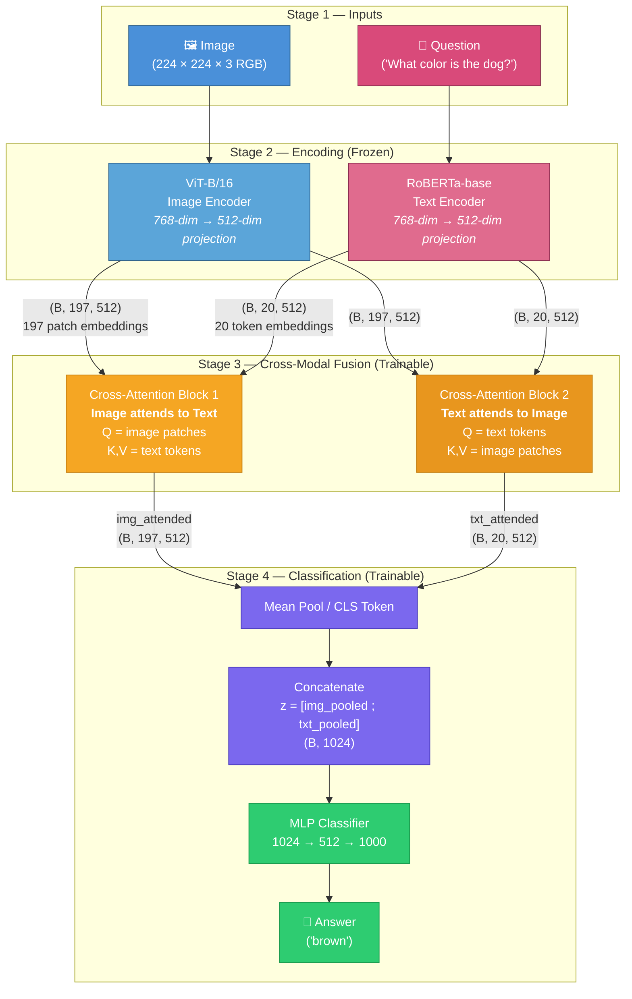

**Tensor shapes at each stage (batch size B=64):**

| Stage | Component | Output Shape | Description |
|-------|-----------|-------------|-------------|
| Input | Image | `(64, 3, 224, 224)` | RGB image, ImageNet-normalized |
| Input | Question tokens | `(64, 20)` | RoBERTa token IDs, padded to 20 |
| Encode | Image features | `(64, 197, 512)` | 196 spatial patches + 1 CLS token |
| Encode | Text features | `(64, 20, 512)` | 20 token embeddings |
| Fuse | Image-attended | `(64, 197, 512)` | Image patches enriched by text |
| Fuse | Text-attended | `(64, 20, 512)` | Text tokens enriched by image |
| Pool | Image pooled | `(64, 512)` | Single vector per image |
| Pool | Text pooled | `(64, 512)` | Single vector per question |
| Concat | Fused | `(64, 1024)` | Joint representation |
| Classify | Logits | `(64, 1000)` | Score per answer class |

---

### 3.2 Image Encoder (ViT-B/16)

The image encoder converts a raw 224×224 RGB image into a sequence of 197 patch embeddings.

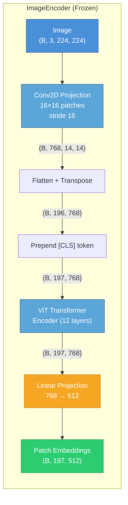

**How it works step by step:**

1. **Patch extraction** (`conv_proj`): A 2D convolution with kernel size 16×16 and stride 16 splits the 224×224 image into a 14×14 grid of non-overlapping patches. Each patch is linearly projected to a 768-dimensional vector. Output: `(B, 768, 14, 14)`.

2. **Flatten**: Reshape the spatial grid into a sequence: `(B, 768, 14, 14)` → `(B, 196, 768)`.

3. **CLS token**: A learnable classification token is prepended to the sequence: `(B, 196, 768)` → `(B, 197, 768)`.

4. **Transformer encoder**: 12 layers of self-attention process all 197 tokens, allowing every patch to attend to every other patch. Output: `(B, 197, 768)`.

5. **Linear projection**: A trainable linear layer maps from 768 to 512 dimensions to match the fusion layer's expected input: `(B, 197, 768)` → `(B, 197, 512)`.

**Freezing:** All ViT parameters (conv_proj, CLS token, encoder layers) are frozen — only the 768→512 projection layer is trainable. This means the ViT's image understanding comes entirely from its ImageNet pre-training.

**Why ViT-B/16?** It produces 196 *spatial* patch tokens — one per 16×16 region of the image. This spatial granularity is essential for cross-attention: the model can learn that the word "left" should attend to patches on the left side of the image, or that "dog" should attend to patches containing the dog.

---

### 3.3 Text Encoder (RoBERTa-base)

The text encoder converts a tokenized question into a sequence of per-token embeddings.

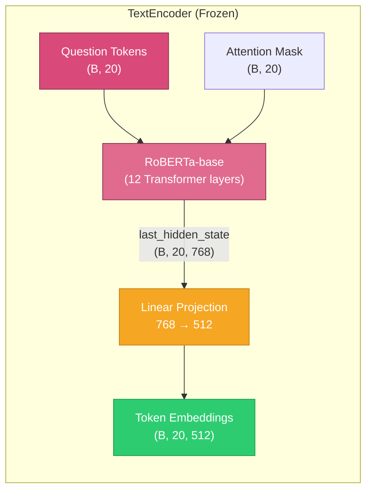

**How it works:**

1. **Tokenization**: The question string is tokenized using RoBERTa's BPE tokenizer, padded/truncated to exactly 20 tokens.

2. **RoBERTa forward pass**: The model processes the tokens through 12 transformer layers, producing contextual embeddings where each token's representation is informed by all other tokens. Output: `(B, 20, 768)`.

3. **Linear projection**: Maps from 768 → 512 to match the fusion layer: `(B, 20, 768)` → `(B, 20, 512)`.

4. **Attention mask**: The padding mask (`1` = real token, `0` = padding) is passed through to the cross-attention layer so that padding tokens are ignored.

**Freezing:** All RoBERTa parameters are frozen; only the projection layer trains.

**Why RoBERTa?** It is a strict upgrade over BERT-base (same size, better pre-training procedure). It preserves per-token embeddings (not a single summary vector), which is critical — the cross-attention mechanism needs word-level granularity to learn which question words guide attention to which image regions.

---

### 3.4 Cross-Attention Block (Building Block)

This is the fundamental building block of the fusion layer. It implements a single direction of cross-modal attention: one modality provides the **queries** (Q), and the other provides the **keys** (K) and **values** (V).

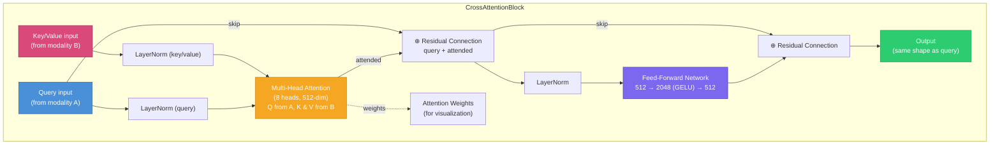

**Detailed operation (for one direction, e.g., image queries attending to text keys/values):**

1. **Pre-Norm**: Apply LayerNorm separately to the query (image patches) and key/value (text tokens). This stabilizes training.

2. **Multi-Head Cross-Attention**: Split the 512-dim vectors into 8 heads of 64 dimensions each. For each head:
   - Compute attention scores: `score = (Q · K^T) / √64`
   - Apply softmax to get attention weights (masked for padding tokens)
   - Compute weighted sum of values: `attended = weights · V`
   - The attention weights are returned for visualization

3. **Residual Connection**: Add the attended output back to the original query: `output = query + attended`. This preserves the original information while enriching it with cross-modal context.

4. **Feed-Forward Network**: A two-layer MLP (512 → 2048 with GELU activation → 2048 → 512) with dropout, followed by another residual connection. This adds non-linear transformation capacity.

**Key insight:** The output has the *same shape as the query input*. If image patches (B, 197, 512) are the query, the output is (B, 197, 512) — the same 197 image patches, but now each patch's representation has been enriched by information from the relevant text tokens.

---

### 3.5 Asymmetric Cross-Modal Fusion (Core Contribution)

This is the core research contribution. The asymmetric fusion uses **two completely independent** `CrossAttentionBlock` instances, each with its own learned weights.

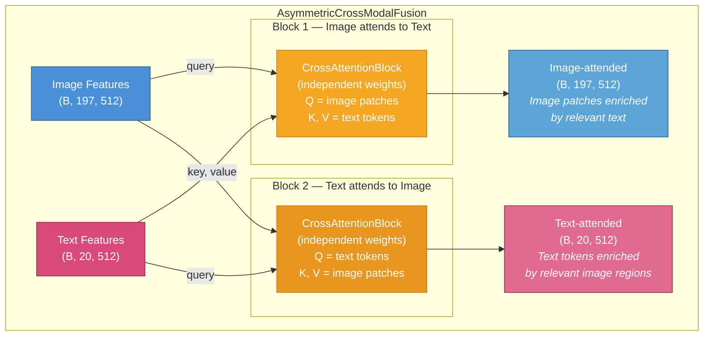

**Why two separate blocks?**

The interaction between image and text in VQA is fundamentally *asymmetric* — each direction serves a different purpose:

| Direction | What It Does | Example |
|-----------|-------------|---------|
| **Image → Text** (Block 1) | Image patches "ask" the text: *"Which words in the question are relevant to me?"* | A patch showing a dog attends strongly to the word "dog" in the question |
| **Text → Image** (Block 2) | Text tokens "ask" the image: *"Which image regions contain evidence for my meaning?"* | The word "color" attends to the specific object being asked about |

Because these are fundamentally different tasks, they should have **different learned weights**. A shared block (symmetric) is forced to use the same transformation for both directions, limiting its expressiveness.

**Parallel vs. Sequential execution:**

- **Local notebook**: Both blocks execute in *parallel* — Block 1 and Block 2 both receive the raw encoder outputs independently.
- **Colab notebook**: The blocks execute *sequentially* — Block 1 runs first (image attends to text), and Block 2's image input is the *output of Block 1* (text attends to already-attended image features). This creates a deeper information flow where the second block benefits from the first.

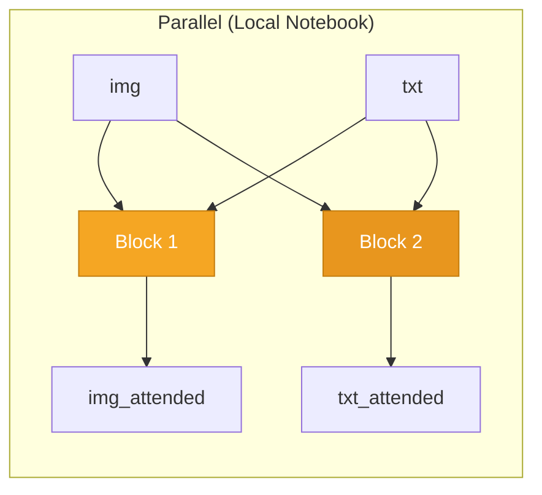

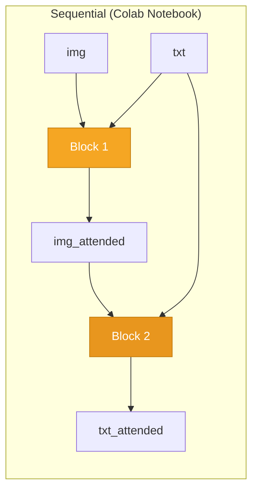

---

### 3.6 Symmetric Cross-Modal Fusion (Baseline)

The symmetric baseline uses a **single shared** `CrossAttentionBlock` for both directions.

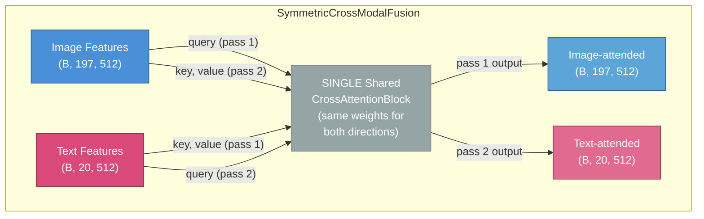

**The limitation:** The same weights process "image queries attending to text" and "text queries attending to image." Since these are fundamentally different tasks, the shared block must compromise — it cannot be optimal for both directions simultaneously. This is the architectural weakness the asymmetric approach addresses.

**Comparison of trainable parameters in the fusion layer:**

| Fusion Type | Cross-Attention Blocks | Weights | Approx. Extra Params |
|-------------|----------------------|---------|---------------------|
| Symmetric | 1 shared block | Same weights for both directions | 1× |
| Asymmetric | 2 independent blocks | Different weights per direction | 2× |

---

### 3.7 Pooling, Concatenation & Classifier

After cross-modal fusion, the attended sequences need to be reduced to fixed-size vectors for classification.

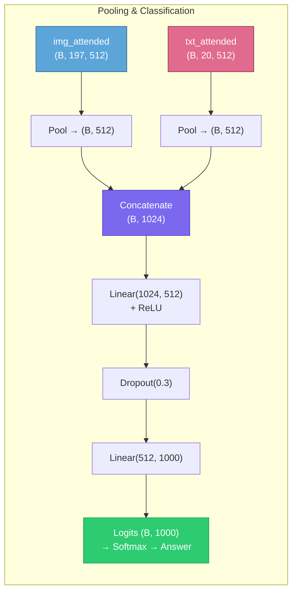

**Pooling strategies:**

| Notebook | Strategy | How It Works |
|----------|----------|-------------|
| Local | Mean pooling | Average all 197 image embeddings and all 20 text embeddings |
| Colab | CLS token (index 0) | Take only the first token (CLS) from each modality |

**Classifier:** A simple 2-layer MLP: `1024 → ReLU → Dropout(0.3) → 512 → 1000`. The 1000 outputs correspond to the 1000 most frequent answers in the VQA training set (covering ~85% of all answers).

---

### 3.8 Full Model Assembly

Putting it all together, here is the complete forward pass:

```
def forward(images, input_ids, attention_mask):

    # Stage 1: Encode (frozen)
    img = image_encoder(images)                    # (B, 197, 512)
    txt = text_encoder(input_ids, attention_mask)   # (B, 20, 512)

    # Stage 2: Cross-modal fusion (trainable)
    text_pad_mask = (attention_mask == 0)            # True where padding
    img_att, txt_att, attn_i2t, attn_t2i = fusion(img, txt, text_pad_mask)

    # Stage 3: Pool + concatenate
    z = concat([pool(img_att), pool(txt_att)])       # (B, 1024)

    # Stage 4: Classify
    logits = classifier(z)                           # (B, 1000)

    return logits, attention_weights
```

**Parameter budget:**

| Component | Parameters | Trainable? |
|-----------|-----------|-----------|
| ViT-B/16 (conv_proj + encoder) | ~86M | No (frozen) |
| RoBERTa-base | ~125M | No (frozen) |
| Image projection (768→512) | ~393K | Yes |
| Text projection (768→512) | ~393K | Yes |
| Cross-attention block(s) | ~2.1M per block | Yes |
| Classifier MLP | ~1.0M | Yes |
| **Total trainable** | **~5.0M** | |
| **Total model** | **~216M** | |

Only ~2.3% of the model's parameters are trained. The rest leverage ImageNet and text pre-training.

---

## 4. Data Pipeline

### Dataset: VQA v2.0

- **Source**: [visualqa.org](https://visualqa.org/)
- **Scale**: ~265K images (MS-COCO), ~1.1M questions, ~11M answers (10 annotators per question)
- **Task**: Given an image and a question, predict the answer (classification over top-1000 answers)

### Data Loading Architecture

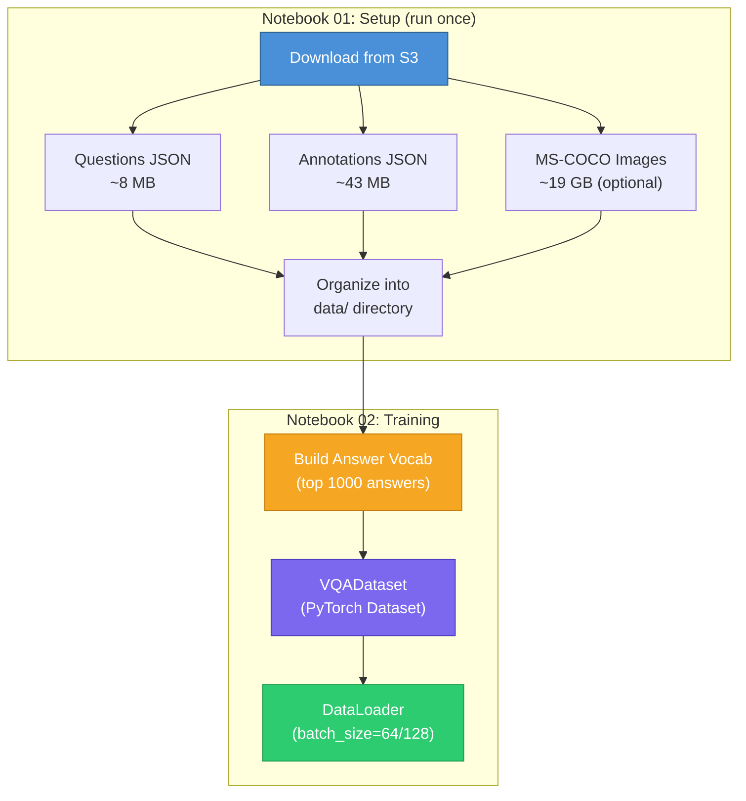

### VQADataset Class

Each `__getitem__` call returns a tuple of `(image_tensor, input_ids, attention_mask, answer_target)`:

| Field | Type | Shape | Description |
|-------|------|-------|-------------|
| `image_tensor` | FloatTensor | `(3, 224, 224)` | ImageNet-normalized, augmented (train) or center-cropped (val) |
| `input_ids` | LongTensor | `(20,)` | RoBERTa BPE token IDs, padded to 20 |
| `attention_mask` | LongTensor | `(20,)` | 1 = real token, 0 = padding |
| `answer_target` | LongTensor or FloatTensor | `()` or `(1000,)` | Hard index (local) or soft distribution (Colab) |

### Answer Vocabulary

The top 1000 most frequent answers are extracted from the training annotations and mapped to indices 0–999. This covers ~85% of all training samples. Samples with answers outside this vocabulary are discarded.

### Colab HDF5 Optimization

The Colab notebook adds an HDF5 pre-processing step: all images are resized to 256×256 and stored in a single `vqa_images.h5` file. This avoids the I/O bottleneck of reading thousands of individual JPEG files from Google Drive and dramatically speeds up data loading.

---

## 5. Training Pipeline

### Configuration

| Parameter | Local Notebook | Colab Notebook |
|-----------|---------------|----------------|
| `NUM_ANSWERS` | 1000 | 1000 |
| `EMBED_DIM` | 512 | 512 |
| `NUM_HEADS` | 8 | 8 |
| `DROPOUT` | 0.3 | 0.2 |
| `FREEZE_ENCODERS` | True | True |
| `MAX_QUESTION_LEN` | 20 | 20 |
| `BATCH_SIZE` | 64 | 128 |
| `LEARNING_RATE` | 1e-4 | 1e-4 |
| `WEIGHT_DECAY` | 1e-5 | 1e-5 |
| `EPOCHS` | 20 | 20 |
| `SEED` | 42 | 42 |

### Training Loop

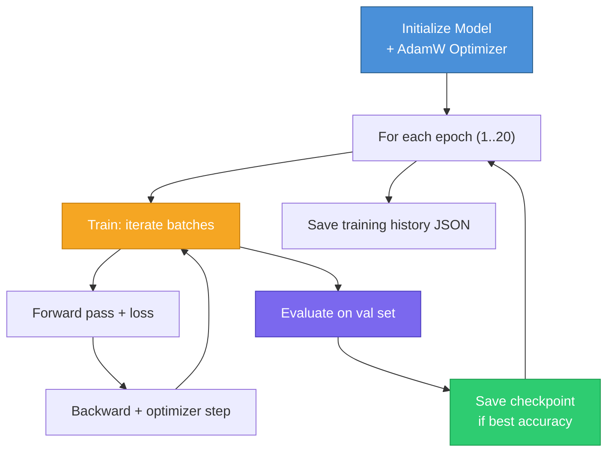

### Loss Functions

| Notebook | Loss | Targets | Rationale |
|----------|------|---------|-----------|
| Local | `CrossEntropyLoss` | Hard label (single integer index) | Simple; one "correct" answer per question |
| Colab | `BCEWithLogitsLoss` | Soft target (probability distribution from 10 annotators) | Accounts for answer ambiguity — e.g., if 7/10 annotators said "yes" and 3 said "yeah," the target is `{yes: 0.7, yeah: 0.3}` |

### Automatic Mixed Precision (AMP)

When running on CUDA, both notebooks use `torch.cuda.amp.autocast()` and `GradScaler` for mixed-precision training (FP16 for forward pass, FP32 for loss scaling). This roughly doubles throughput on the A100 GPU.

---

## 6. Evaluation & Analysis

### Metrics

| Metric | Used In | Formula |
|--------|---------|---------|
| **Top-1 Accuracy** | Local | `(argmax(logits) == target).mean()` |
| **Top-5 Accuracy** | Local | `(target in top-5 predictions).mean()` |
| **VQA Accuracy** | Colab | `min(1, annotator_count / 3)` averaged over all samples. If 3+ annotators gave the predicted answer, it scores 1.0. |

### Additional Analyses (Colab Only)

**1. Question-Type Accuracy:**

Questions are categorized by their first words:

| Category | Detection Rule | Example |
|----------|---------------|---------|
| Yes/No | Starts with "is", "are", "was", "does", etc. | "Is this a dog?" |
| Count | Starts with "how many" | "How many people are there?" |
| Color | Starts with "what color" | "What color is the car?" |
| Other | Everything else | "What is the person doing?" |

Per-category VQA accuracy is computed and plotted as a grouped bar chart.

**2. Modality Ablation:**

Both models are evaluated under three conditions:

| Condition | Modification | Purpose |
|-----------|-------------|---------|
| Full Data | Normal inputs | Baseline performance |
| Image-Blind | Image tensor zeroed out | How much does the model rely on visual information? |
| Text-Blind | Input IDs and attention mask zeroed | How much does the model rely on the question text? |

**3. Error Analysis:**

The code searches for "divergent cases" where the asymmetric model answers correctly but the symmetric model fails. For these cases, both models' attention heatmaps are visualized side-by-side to understand *why* the asymmetric model succeeds.

---

## 7. Recorded Results

The following results are from the Colab notebook trained on a **1,000-sample development subset** with seed 42.

### Training Progression (Asymmetric Model)

| Epoch | Train Loss | Train Acc | Val VQA Acc |
|-------|-----------|-----------|-------------|
| 1 | 0.5395 | 0.3% | 0.0% |
| 5 | 0.0083 | 9.9% | 27.3% |
| 10 | 0.0064 | 15.1% | 28.6% |
| 15 | 0.0057 | 16.1% | 28.5% |
| 20 | 0.0052 | 17.9% | 28.5% |

### Training Progression (Symmetric Model)

| Epoch | Train Loss | Train Acc | Val VQA Acc |
|-------|-----------|-----------|-------------|
| 1 | 0.5531 | 0.1% | 0.1% |
| 5 | 0.0081 | 10.6% | 28.4% |
| 10 | 0.0064 | 13.0% | 28.5% |
| 15 | 0.0058 | 16.1% | 28.4% |
| 20 | 0.0052 | 19.4% | 28.3% |

### Final Comparison

| Model | Best Val VQA Acc | Final Train Acc | Trainable Params |
|-------|-----------------|----------------|-----------------|
| **Symmetric** | ~28.5% | ~19.4% | ~4.98M |
| **Asymmetric** | ~28.6% | ~17.9% | ~4.98M + extra block |

> **Note:** On a 1,000-sample subset, both models converge to essentially the same accuracy (~28.5%). This is expected — the dataset is far too small to reveal statistically meaningful differences between the two approaches. Full-scale training on 50K–200K samples is required for a proper comparison.

---

## 8. Differences Between Local and Colab Notebooks

| Aspect | Local Notebook | Colab Notebook |
|--------|---------------|----------------|
| **Data source** | Raw JPEG files from disk | HDF5 pre-processed file |
| **Answer targets** | Hard labels (single index) | Soft targets (10-annotator distribution) |
| **Loss function** | `CrossEntropyLoss` | `BCEWithLogitsLoss` |
| **Pooling** | Mean over full sequence | CLS token (index 0) |
| **Fusion execution** | Parallel (both blocks get raw features) | Sequential (Block 2 gets Block 1's output) |
| **Batch size** | 64 | 128 |
| **Dropout** | 0.3 | 0.2 |
| **Evaluation metric** | Top-1 and Top-5 accuracy | VQA accuracy |
| **Extra analyses** | None | Question-type accuracy, modality ablation, error analysis |
| **Checkpoint saving** | Enabled | Commented out |

### Architectural Divergence: Parallel vs Sequential Fusion

The most significant difference is in the `AsymmetricCrossModalFusion.forward()` method:

**Local (parallel):**
```
img_attended = block1(query=img, key_value=txt)      # image attends to raw text
txt_attended = block2(query=txt, key_value=img)      # text attends to raw image
```

**Colab (sequential):**
```
img_attended = block1(query=img, key_value=txt)      # image attends to raw text
txt_attended = block2(query=txt, key_value=img_attended)  # text attends to ATTENDED image
```

The sequential version creates a two-step reasoning process: first understand which parts of the question are relevant to each image region, then use that enriched image representation to inform which visual evidence matters for each question word.

---

## 9. Implementation Assessment

### Strengths

- **Architecturally correct**: The cross-attention blocks properly implement pre-norm residual connections, multi-head attention with padding masks, and feed-forward networks — following standard transformer best practices.
- **Clean code**: Well-organized notebooks with clear cell documentation, configuration cells, and modular functions.
- **Proper use of PyTorch primitives**: Uses `nn.MultiheadAttention` (battle-tested), `GradScaler` for AMP, and correct frozen parameter handling.
- **Comprehensive evaluation**: The Colab notebook includes VQA accuracy, question-type breakdown, modality ablation, error analysis, and rich visualizations.
- **Attention visualization**: Both directions (text→image heatmaps, image→text bar charts) are visualized, directly demonstrating the asymmetric nature of the learned attention.
- **Practical Colab optimization**: HDF5 preprocessing, AMP, and proper DataLoader configuration for GPU training.

### Areas for Improvement

| Issue | Impact | Status |
|-------|--------|--------|
| **Only 1K samples trained** | Cannot see meaningful symmetric vs asymmetric difference | Needs full-scale training |
| **Missing baselines** | Proposal calls for 5 models (Early Fusion, Late Fusion, SAN, Symmetric, Asymmetric); only 2 implemented | Early Fusion, Late Fusion, SAN not implemented |
| **No standalone modules** | All code in notebooks; harder to test, reuse, and maintain | Proposed `models/`, `training/` structure not built |
| **Checkpoint saving disabled** in Colab | Trained models not persisted across sessions | `torch.save` calls are commented out |
| **No multi-seed runs** | Cannot assess statistical significance | Only seed 42 used |
| **Local notebook interrupted** | Symmetric training stopped after 5 epochs; asymmetric never trained locally | Only Colab run completed |
| **Two fusion variants** (parallel vs sequential) without comparison | Unclear which is better | Should be tested explicitly |
| **Deprecated API usage** | `torch.cuda.amp.autocast` is deprecated in newer PyTorch; Colab notebook partially migrated to `torch.amp.autocast('cuda')` | Mixed state |

---

## 10. Remaining Work & Recommendations

### Critical Path (Must Do)

1. **Scale up training**: Train both models on 50K–200K samples to see meaningful accuracy differences.
2. **Re-enable checkpoint saving**: Uncomment `torch.save` calls in the Colab notebook.
3. **Multi-seed evaluation**: Run each model with 3 different seeds and report mean ± std.
4. **Settle on one fusion variant**: Choose either parallel or sequential asymmetric fusion and use consistently.

### Recommended Additions

5. **Add missing baselines**: Implement Early Fusion, Late Fusion, and optionally SAN to strengthen the comparison (as proposed).
6. **Extract code into modules**: Move model definitions, training loops, and evaluation into standalone `.py` files for maintainability.
7. **Add a learning rate scheduler**: e.g., cosine annealing or warmup + linear decay — standard practice for transformer training.

### Stretch Goals (From Proposal)

8. **Encoder fine-tuning experiment**: Unfreeze the last 1–2 layers of ViT/RoBERTa and compare.
9. **Gradio web demo**: Interactive image upload + question → answer + attention heatmap.
10. **Second dataset**: Test on Hateful Memes or MS-COCO retrieval to demonstrate generalizability.

---

## 11. Proposal for Improvement

The current implementation is architecturally sound but leaves significant accuracy on the table due to design choices that can be improved **without changing the core research question** (asymmetric vs. symmetric cross-attention). Every improvement below is feasible on Colab Pro with frozen encoders, and each one is designed to widen the gap between asymmetric and symmetric models — making the project's central thesis easier to demonstrate.

The improvements are organized from highest-impact to lowest-impact, with block diagrams showing exactly what changes.

---

### 11.1 Fusion Architecture Improvements

These changes modify the cross-modal fusion layer — the trainable core of the model — to give the asymmetric approach more capacity to learn directional patterns.

#### Improvement A: Stack Multiple Cross-Attention Layers (Depth)

**The problem:** The current model uses a single cross-attention layer per direction. One layer of attention is a shallow operation — it can identify *what* to attend to, but it cannot iteratively *refine* that understanding. Research on transformers consistently shows that stacking layers improves representation quality.

**The fix:** Stack 2–3 cross-attention layers per direction. Each layer refines the output of the previous one.

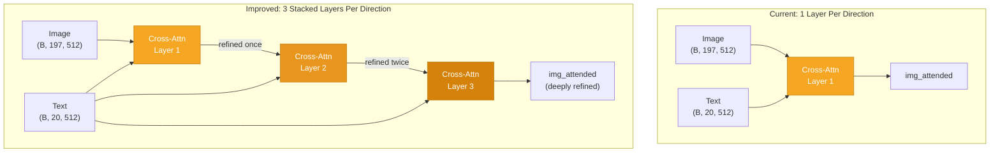

**Why this helps asymmetric more than symmetric:** With shared weights (symmetric), stacking layers doesn't introduce new capacity — the same transformation is applied repeatedly. With independent weights (asymmetric), each stacked layer is a genuinely new transformation, compounding the advantage.

**Implementation sketch:**

```python
class AsymmetricCrossModalFusion(nn.Module):
    def __init__(self, embed_dim, num_heads=8, num_layers=3, dropout=0.1):
        super().__init__()
        self.img_to_txt_layers = nn.ModuleList([
            CrossAttentionBlock(embed_dim, num_heads, dropout)
            for _ in range(num_layers)
        ])
        self.txt_to_img_layers = nn.ModuleList([
            CrossAttentionBlock(embed_dim, num_heads, dropout)
            for _ in range(num_layers)
        ])

    def forward(self, img, txt, text_pad_mask=None):
        for layer in self.img_to_txt_layers:
            img, _ = layer(query=img, key_value=txt, key_padding_mask=text_pad_mask)
        for layer in self.txt_to_img_layers:
            txt, _ = layer(query=txt, key_value=img)
        return img, txt
```

**Cost:** ~2x more trainable parameters per added layer (~2M each). Still well within Colab Pro A100 budget with frozen encoders.

**Expected impact:** High. Stacking is one of the most reliable ways to improve transformer performance. Expect 2–5% VQA accuracy gain.

---

#### Improvement B: Interleaved (Alternating) Cross-Attention

**The problem:** In the current sequential design, Block 1 runs fully (image attends to text), then Block 2 runs fully (text attends to the attended image). Information flows in only one "round." The image features that Block 1 produces never get to be updated by what Block 2 learned about the text.

**The fix:** Alternate the direction at each layer, so information flows back and forth between modalities multiple times:

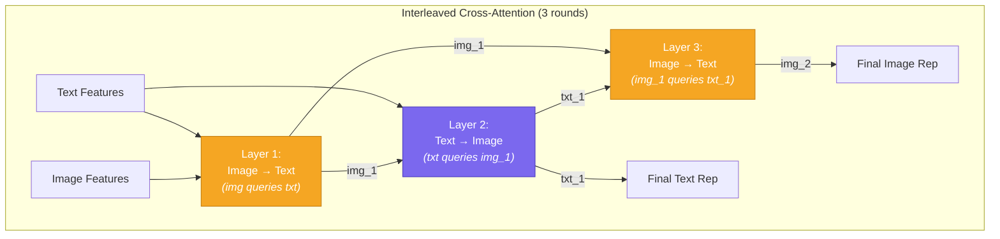

Each layer has its own weights (all independent — maximally asymmetric). The key insight is that Layer 3's image representation is informed by text that has already been grounded in the image (from Layer 2), creating a deeper reasoning chain than the current two-step design.

**Implementation sketch:**

```python
class InterleavedAsymmetricFusion(nn.Module):
    def __init__(self, embed_dim, num_heads=8, num_rounds=3, dropout=0.1):
        super().__init__()
        self.layers = nn.ModuleList([
            CrossAttentionBlock(embed_dim, num_heads, dropout)
            for _ in range(num_rounds)
        ])

    def forward(self, img, txt, text_pad_mask=None):
        for i, layer in enumerate(self.layers):
            if i % 2 == 0:  # even layers: image attends to text
                img, _ = layer(query=img, key_value=txt, key_padding_mask=text_pad_mask)
            else:            # odd layers: text attends to image
                txt, _ = layer(query=txt, key_value=img)
        return img, txt
```

**Expected impact:** Medium-High. This is a natural extension of the current sequential approach and should improve performance on questions requiring multi-step reasoning (e.g., "What is the color of the object to the left of the cat?").

---

#### Improvement C: Add Self-Attention Before Cross-Attention

**The problem:** The frozen encoder outputs are fed directly into cross-attention. But the ViT patches and RoBERTa tokens were pre-trained independently — they've never seen each other's modality. A "warm-up" self-attention layer within each modality allows the representations to be adapted to the fusion context before cross-attending.

**The fix:** Add one trainable self-attention layer per modality before the cross-attention:

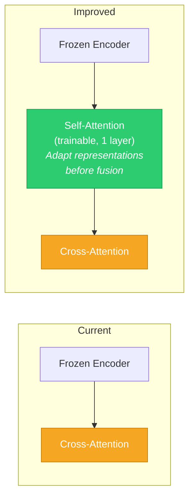

This gives the model a trainable "adapter" between the frozen encoders and the fusion layer. The self-attention can re-weight which patches or tokens are most important for VQA (as opposed to ImageNet classification or masked language modeling, which is what the encoders were originally trained for).

**Cost:** ~1M parameters per self-attention layer. Negligible.

**Expected impact:** Medium. Particularly helpful for spatial reasoning questions where the frozen ViT patch representations need task-specific reorganization.

---

### 11.2 Training Regime Improvements

These changes don't alter the model architecture but improve how it learns.

#### Improvement D: Learning Rate Warmup + Cosine Decay

**The problem:** The current training uses a constant learning rate of 1e-4 for all 20 epochs. This is a known sub-optimal strategy for transformer-based models. The initial random weights in the fusion layers can cause large, unstable gradient updates at the start, and a constant LR doesn't allow the model to settle into a fine-grained optimum at the end.

**The fix:** Use a linear warmup for the first 5–10% of training, then cosine decay to a very small final LR:

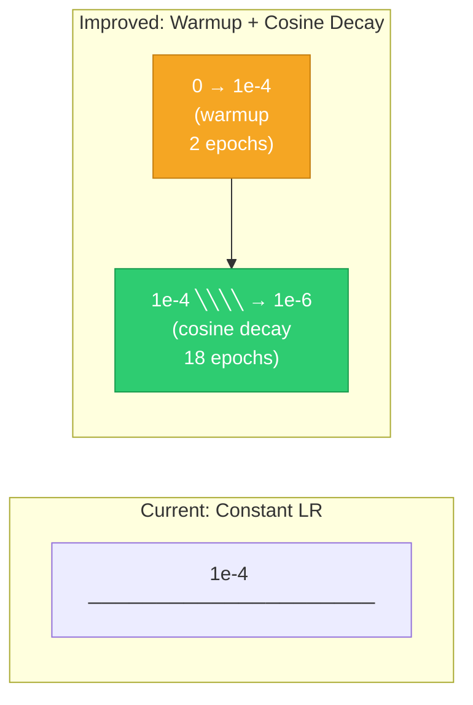

**Implementation:**

```python
from torch.optim.lr_scheduler import CosineAnnealingLR, LinearLR, SequentialLR

warmup = LinearLR(optimizer, start_factor=0.01, total_iters=warmup_epochs)
cosine = CosineAnnealingLR(optimizer, T_max=EPOCHS - warmup_epochs, eta_min=1e-6)
scheduler = SequentialLR(optimizer, schedulers=[warmup, cosine], milestones=[warmup_epochs])
```

**Expected impact:** Medium. Standard practice in all modern transformer training. Free accuracy improvement with no added complexity.

---

#### Improvement E: Gradient Clipping

**The problem:** There is no gradient clipping in the current training loop. Cross-attention gradients can spike, especially early in training when attention weights are near-random. This can cause unstable optimization or, in extreme cases, NaN losses.

**The fix:** Add `torch.nn.utils.clip_grad_norm_` before the optimizer step:

```python
if scaler is not None:
    scaler.unscale_(optimizer)
    torch.nn.utils.clip_grad_norm_(model.parameters(), max_norm=1.0)
    scaler.step(optimizer)
    scaler.update()
else:
    torch.nn.utils.clip_grad_norm_(model.parameters(), max_norm=1.0)
    optimizer.step()
```

**Expected impact:** Low-Medium. Prevents training instability. Particularly important when scaling up to larger datasets where rare batches can produce extreme gradients.

---

#### Improvement F: Label Smoothing

**The problem:** The Colab notebook uses `BCEWithLogitsLoss` with soft targets (good), but the local notebook uses `CrossEntropyLoss` with hard labels. Even with the soft targets, the model can still overfit to the exact annotator distribution on small datasets.

**The fix:** Add label smoothing to regularize the output distribution:

```python
criterion = nn.CrossEntropyLoss(label_smoothing=0.1)
```

Or for the BCE case, clamp the soft targets away from exact 0 and 1:

```python
targets = targets.clamp(min=0.05 / num_classes, max=1.0 - 0.05)
```

**Expected impact:** Low-Medium. Prevents overconfident predictions and improves generalization, especially on the smaller subset sizes used in development.

---

### 11.3 Data & Representation Improvements

These changes improve the quality of the input representations without modifying the model architecture.

#### Improvement G: Learnable Positional Embeddings in the Fusion Layer

**The problem:** The frozen ViT includes positional embeddings for its 196 patches, but the cross-attention fusion layer receives these positions implicitly (baked into the frozen representations). The fusion has no explicit awareness of *spatial structure* — it doesn't know that patch 0 is top-left and patch 195 is bottom-right.

**The fix:** Add learnable positional embeddings to both the image and text sequences before cross-attention:

```python
self.img_pos_embed = nn.Parameter(torch.randn(1, 197, embed_dim) * 0.02)
self.txt_pos_embed = nn.Parameter(torch.randn(1, max_seq_len, embed_dim) * 0.02)

# In forward:
img = img + self.img_pos_embed
txt = txt + self.txt_pos_embed[:, :txt.size(1), :]
```

This is very lightweight (~100K parameters) and gives the cross-attention explicit position information that can be tuned for the VQA task.

**Expected impact:** Low-Medium. Helps with spatial reasoning questions ("What is to the left of...?", "How many objects are in the top half?").

---

#### Improvement H: Increase Answer Vocabulary to 3000

**The problem:** The current top-1000 answer vocabulary covers ~85% of training samples. The remaining 15% of samples are *discarded* — the model never learns from them. This is a significant data waste, especially at smaller subset sizes.

**The fix:** Increase `NUM_ANSWERS` from 1000 to 3000, which covers ~95% of samples. The classifier grows from `Linear(512, 1000)` to `Linear(512, 3000)` — a tiny increase in parameters.

**Trade-off:** The long-tail answers (answers 1001–3000) have very few training examples, so the model will rarely predict them. But the improved coverage means more training samples are useful, which helps the model learn better general features.

**Expected impact:** Low. A modest improvement from recovering otherwise-discarded training data.

---

### 11.4 Classifier & Pooling Improvements

These changes affect how the fused representations are turned into answer predictions.

#### Improvement I: Gated Fusion Instead of Concatenation

**The problem:** The current model simply concatenates the pooled image and text vectors: `z = [img_pooled ; txt_pooled]`. This treats both modalities equally and leaves it entirely to the downstream MLP to figure out the relative importance. For some questions (e.g., "Is there a dog?"), the image is more important. For others (e.g., "What is 2+3?"), the text alone suffices.

**The fix:** Use a learned gating mechanism that dynamically weights the two modalities:

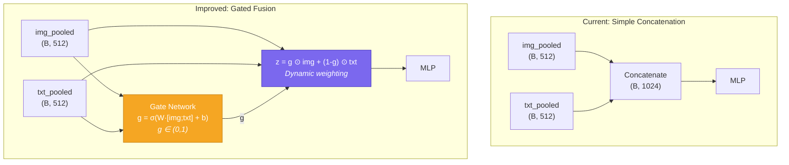

**Implementation:**

```python
class GatedFusion(nn.Module):
    def __init__(self, embed_dim):
        super().__init__()
        self.gate = nn.Sequential(
            nn.Linear(embed_dim * 2, embed_dim),
            nn.Sigmoid()
        )

    def forward(self, img_pooled, txt_pooled):
        g = self.gate(torch.cat([img_pooled, txt_pooled], dim=-1))
        return g * img_pooled + (1 - g) * txt_pooled  # (B, 512)
```

This reduces the input to the classifier from 1024 to 512, and the gate learns to dynamically weight each modality per-sample.

**Expected impact:** Medium. Makes the model adaptive to different question types. Also provides an interpretable signal — the gate values reveal which modality the model relies on for each question.

---

#### Improvement J: Deeper Classifier with Batch Normalization

**The problem:** The current classifier is a simple 2-layer MLP: `Linear(1024→512) → ReLU → Dropout → Linear(512→1000)`. For a 1000-class classification problem, this is quite shallow. The single hidden layer may not have enough capacity to map the fused 1024-dim representation to the nuanced answer space.

**The fix:** Increase to 3 layers with batch normalization:

```python
self.classifier = nn.Sequential(
    nn.Linear(embed_dim * 2, embed_dim),
    nn.BatchNorm1d(embed_dim),
    nn.GELU(),
    nn.Dropout(0.3),
    nn.Linear(embed_dim, embed_dim),
    nn.BatchNorm1d(embed_dim),
    nn.GELU(),
    nn.Dropout(0.2),
    nn.Linear(embed_dim, num_answers),
)
```

**Why BatchNorm?** It normalizes activations across the batch, which stabilizes training and acts as a regularizer. `GELU` is used instead of `ReLU` for consistency with the rest of the transformer architecture.

**Expected impact:** Low-Medium. A modest improvement from giving the classifier more expressive capacity.

---

### 11.5 Summary: Prioritized Improvement Roadmap

The following table prioritizes all improvements by expected impact and implementation effort, allowing the project to pick the most valuable changes first.

#### Priority Matrix

| Priority | Improvement | Category | Expected Impact | Effort | Extra Params |
|----------|-------------|----------|----------------|--------|-------------|
| **1** | **D. LR Warmup + Cosine Decay** | Training | Medium | 5 lines of code | 0 |
| **2** | **E. Gradient Clipping** | Training | Low-Medium | 3 lines of code | 0 |
| **3** | **A. Stack Multiple Layers** | Architecture | High | Moderate refactor | ~2M per layer |
| **4** | **I. Gated Fusion** | Classifier | Medium | New module | ~262K |
| **5** | **B. Interleaved Cross-Attention** | Architecture | Medium-High | Moderate refactor | ~2M per layer |
| **6** | **C. Self-Attention Adapters** | Architecture | Medium | New module | ~1M per layer |
| **7** | **F. Label Smoothing** | Training | Low-Medium | 1 line of code | 0 |
| **8** | **J. Deeper Classifier** | Classifier | Low-Medium | Small edit | ~262K |
| **9** | **G. Positional Embeddings** | Representation | Low-Medium | Small edit | ~100K |
| **10** | **H. Expand Answer Vocab** | Data | Low | Config change | ~1M |

#### Recommended Implementation Order

The improvements are grouped into three waves that build on each other:

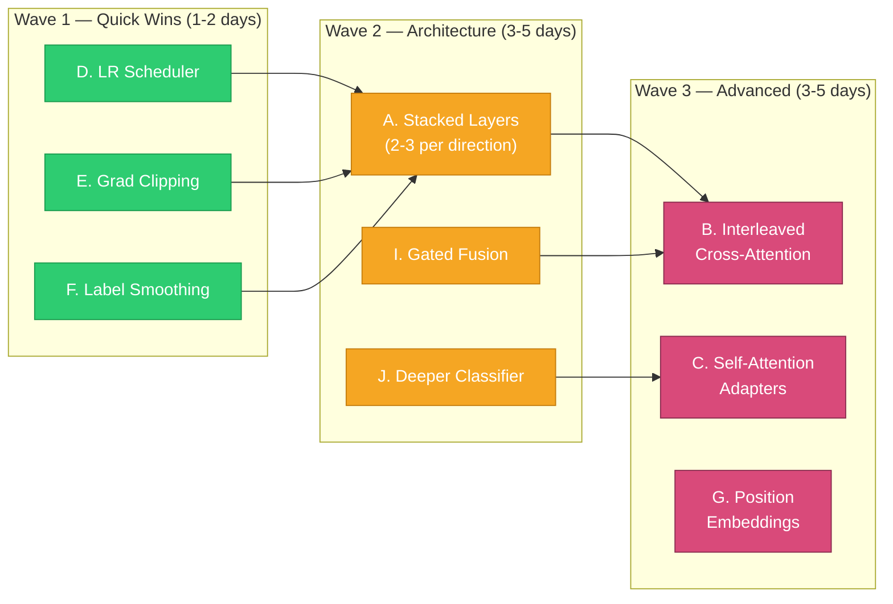

**Wave 1** requires zero architectural changes — just add a scheduler, clipping, and smoothing to the existing training loop. These should be applied first because they improve *every* model variant, establishing a stronger baseline before testing architectural changes.

**Wave 2** changes the model architecture. Stacked layers (A) is the single highest-impact change and should be prioritized. Gated fusion (I) and a deeper classifier (J) are complementary and can be added in the same round.

**Wave 3** is for diminishing returns. Interleaved cross-attention (B) is an alternative to stacked layers — try one or the other, not both initially. Self-attention adapters (C) and positional embeddings (G) are incremental refinements.

#### Impact on the Project's Central Thesis

Critically, every improvement above is designed to **amplify the advantage of asymmetric over symmetric fusion**:

- **Stacked layers / interleaved attention** multiply the number of independent weight matrices in the asymmetric model, widening the capacity gap over the symmetric baseline.
- **Gated fusion** gives the asymmetric model a way to dynamically leverage the fact that it has *two differently-attended* representations, rather than collapsing them via simple concatenation.
- **Training improvements** (scheduler, clipping, smoothing) help the asymmetric model's extra parameters converge more reliably, reducing the chance that the symmetric model "gets lucky" from simpler optimization.
- **Self-attention adapters** give the asymmetric model task-specific representations to cross-attend over, rather than generic pre-trained features — increasing the value of directional attention.

All improvements remain within the project's constraints: frozen encoders, Colab Pro A100, and the VQA v2.0 dataset. The total additional parameter budget across all improvements is ~10–15M — bringing the trainable count from ~5M to ~15–20M, still a fraction of the 211M frozen parameters and easily handled by the A100.

---

*Document generated from implementation review of the `Asymmetric-Cross-Modal-Attention` repository. All code references correspond to the notebooks in `notebooks/`.*
