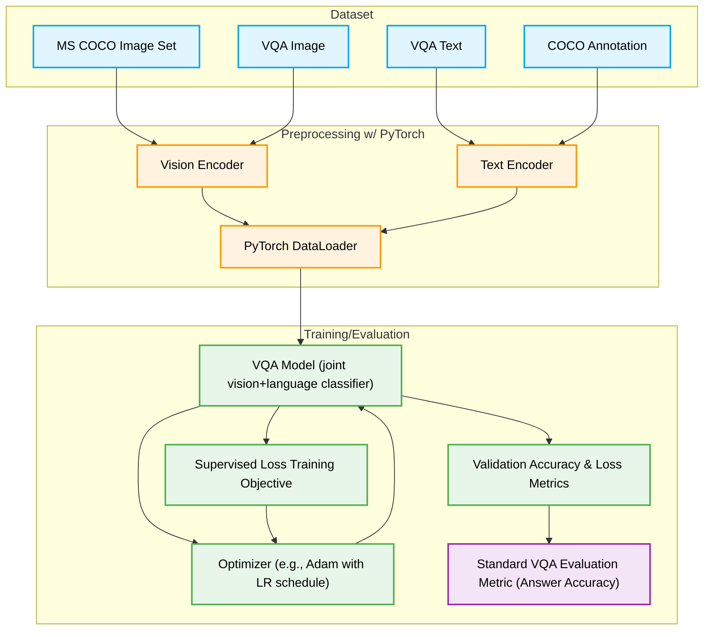

# Asymmetric-Cross-Modal-Attention

## Implementation



# The `Training/Evaluation` step using VQA

**VQA Model (Joint Vision+Language Classifier)**
* Initializes the core multi-modal architecture that fuses the extracted image and text features.
* Forces Questions/answers to attend to images, and vice versa during training. (aka. asymmetric)
* **Framework:** PyTorch (`torch.nn.Module`) for constructing the network layers and forward pass logic.


**Loss Function**
* Computes the error between the model's predicted logits and the ground-truth target answers.
* Drives the learning process by penalizing incorrect predictions.
* **Framework:** PyTorch Loss Functions (e.g., `torch.nn.CrossEntropyLoss`, or `torch.nn.BCEWithLogitsLoss`).


**Optimizer (e.g., Adam with LR schedule)**
* Performs backpropagation to calculate gradients based on the computed loss.
* Updates the model's weights iteratively to minimize the loss function.
* **Framework:** PyTorch Optimizers (`torch.optim.Adam`) and Schedulers (`torch.optim.lr_scheduler`).


**Validation Accuracy & Loss Metrics**
* Runs the model on the validation split at the end of each epoch.
* Monitors performance on unseen data to track generalization.


**VQA Evaluation Metric (Answer Accuracy)**
* Compares the model's predicted answer against the human annotations provided in the VQA dataset to determine the final accuracy score.
* **Framework:** [VQA Python API](https://github.com/GT-Vision-Lab/VQA).

# The `Training/Evaluation` step using MS-COCO

**Preprocessing and preparation**
* Processes the raw images to identify distinct objects, outputting predicted bounding box coordinates and object class probabilities.
* Feeds the labelled training set into the  cross-modal attention framework.
* **Framework:** PyTorch (`torchvision.models.detection`, or custom-made `torch.nn.Module`).

**Asymmetric Cross-Modal Processing**
* Feeds the COCO images and labels into two the two directional attention blocks
* Forces the labels to compute attention weights over specific COCO object regions first (Text-to-Image), and then uses those iamges to attend back to the labels (Image-to-Text).
* Framework: PyTorch (torch.nn.MultiheadAttention implemented sequentially to enforce the asymmetric flow).

**Optimizer & Learning Rate Scheduling**
* Computes loss based on the final VQA answer prediction, but gradients update the asymmetric attention weights to better align the text with the MS-COCO object regions.
* **Framework:** PyTorch Loss Functions (`torch.nn.BCEWithLogitsLoss`) and Optimizers (`torch.optim.Adam`).


**COCO Evaluation Metric (Mean Average Precision - mAP)**
* Cmpares predicted boxes, classes, and confidence scores against MS-COCO annotations.
* **Framework:** [COCO Python API (`pycocotools`)](https://github.com/cocodataset/cocoapi)).

**Symmetric Cross-Modal Preprocessing**
* The model will proccess the text and images at the same time.
* Image and text features are concatenated or proccessed using parallel attention heads
* The model performance is compared with the Asymmetric Solution using the same eval metric

---

## Proposed Framework

```mermaid
graph TD
classDef input fill:#e1f5fe,stroke:#03a9f4,stroke-width:2px,color:#000
classDef feature/fusion fill:#fff3e0,stroke:#ff9800,stroke-width:2px,color:#000
classDef attention/eval fill:#e8f5e9,stroke:#4caf50,stroke-width:2px,color:#000
classDef output/pytorch fill:#f3e5f5,stroke:#9c27b0,stroke-width:2px,color:#000

ImgF[Image Features]:::input
TxtF[Text Features]:::input

subgraph Asymmetric Cross Modal Attention
TtoI[Text attends to Image]:::attention/eval
ItoT[Image attends to Text]:::attention/eval
end

ImgF --> TtoI
TxtF --> TtoI
TtoI --> AttImg[Attended Image Features]:::feature/fusion

TxtF --> ItoT
AttImg --> ItoT
ItoT --> AttTxt[Attended Text Features]:::feature/fusion

AttImg --> Fusion[Feature Fusion Concat]:::feature/fusion
AttTxt --> Fusion

Fusion --> FC[Fully Connected Layers]:::output/pytorch
FC --> Heatmaps[Attention Heatmaps]:::output/pytorch
FC --> Final[Final Prediction]:::output/pytorch
```

---

Related Work: Stacked Attention Network (SAN) for VQA: https://arxiv.org/pdf/1511.02274

SAN Architecture:

```mermaid
graph TD
    classDef input fill:#e1f5fe,stroke:#03a9f4,stroke-width:2px,color:#000
    classDef feature fill:#fff3e0,stroke:#ff9800,stroke-width:2px,color:#000
    classDef attention fill:#e8f5e9,stroke:#4caf50,stroke-width:2px,color:#000
    classDef output fill:#f3e5f5,stroke:#9c27b0,stroke-width:2px,color:#000

    I[Image]:::input --> CNN[CNN Feature Extractor]
    Q[Question]:::input --> RNN[Text Encoder]

    CNN --> V[Image Features V]:::feature
    RNN --> U0[Question Vector U0]:::feature

    subgraph SAN [Stacked Attention Network Baseline]
        V --> AL1[Attention Layer 1]:::attention
        U0 --> AL1
        AL1 --> U1[Refined Query U1]:::feature

        V --> AL2[Attention Layer 2]:::attention
        U1 --> AL2
        AL2 --> U2[Refined Query U2]:::feature
    end

    U2 --> CLS[Classifier / MLP]:::output
    CLS --> Final[Predicted Answer]:::output
    ```
